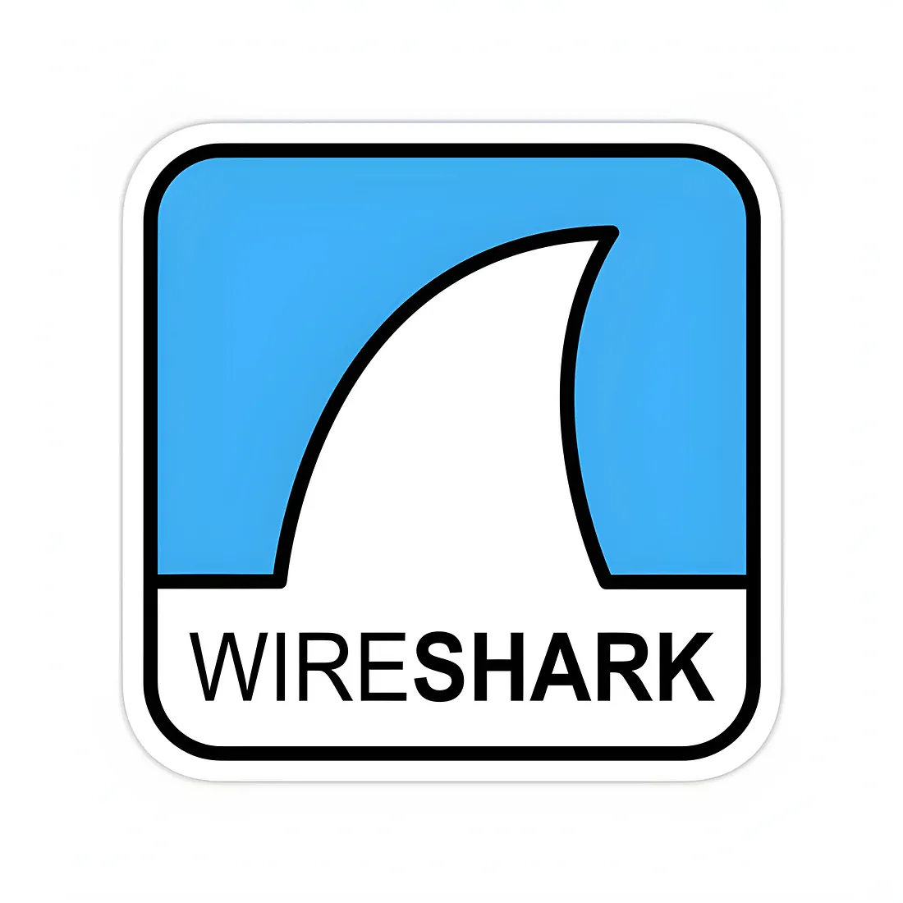
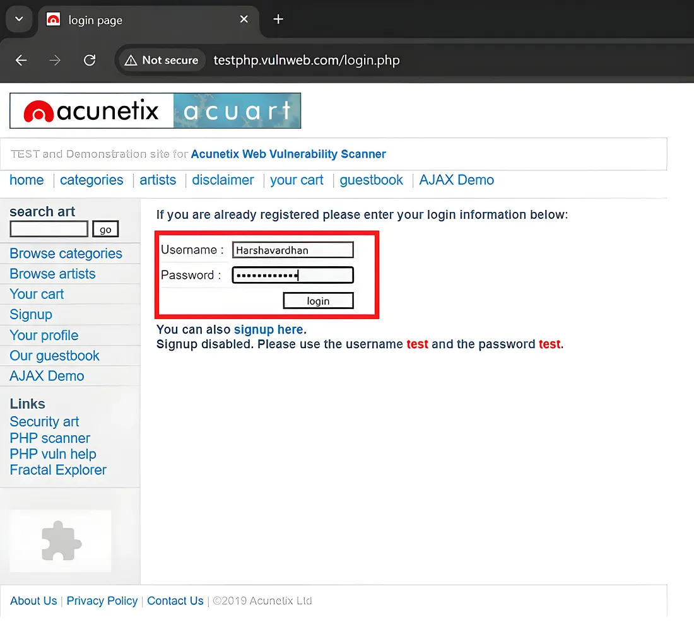
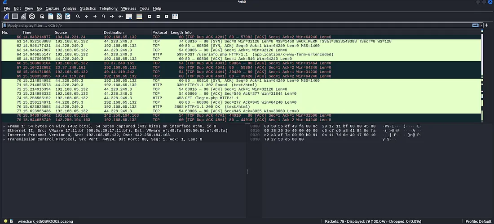
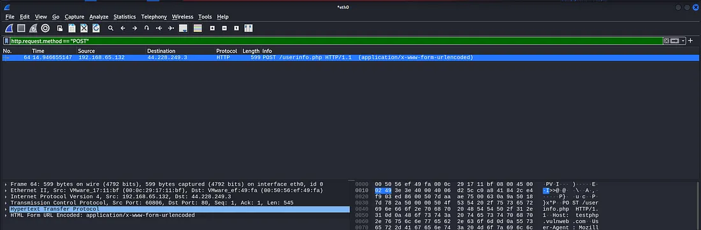
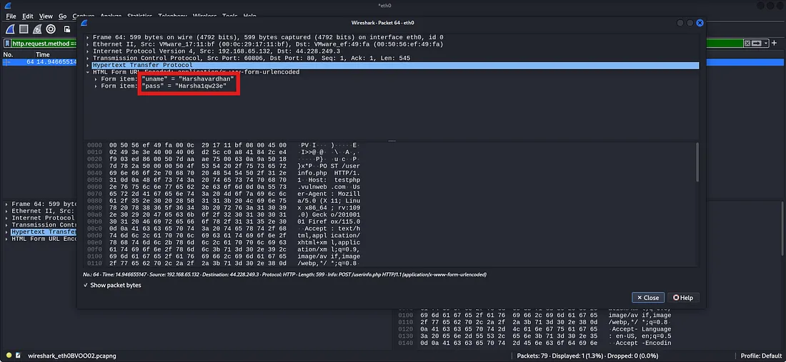

# Packet Sniffing with Wireshark to Capture Login Credentials

### Unrevealing Network Vulnerabilities

## Introduction

Have you ever wondered how secure your login credentials are when you enter them on a website? The truth is, if the network is not encrypted, your sensitive information might be exposed to anyone with the right tools. This is where tools like Wireshark come into play. Wireshark is a powerful network protocol analyzer that allows you to capture and inspect packets moving through a network. Today, we’ll explore how unencrypted or weakly encrypted credentials can be sniffed out using Wireshark.

## Understanding Packet Sniffing

Let’s start with the basics. Packet sniffing is the process of capturing data packets that travel over a network. Think of it as eavesdropping on a conversation, except here, the conversation is digital data.

- **Ethical vs. Unethical Use Cases**: While ethical hackers use packet sniffing to identify vulnerabilities and secure networks, malicious actors can exploit it to steal sensitive data. The key difference lies in **intent** and **authorization**.
- **Real-World Example**: Imagine a public Wi-Fi network in a coffee shop. If the network uses HTTP instead of HTTPS, anyone on the same network can potentially intercept your login credentials.

## Set Up Wireshark

Before we start capturing packets, we need to set up Wireshark. Here’s how:

1. **Download and Install Wireshark**: Head over to [Wireshark’s official website](https://www.wireshark.org/download.html) and download the appropriate version for your operating system.
2. **Launch Wireshark**: Once installed, open Wireshark, and you’ll see a list of network interfaces.



Now, let’s capture some packets. Follow these steps:

1. **Select a Network Interface**: Choose the network interface you want to monitor. For example, if you’re connected to Wi-Fi, select the Wi-Fi interface.
2. **Start Capturing**: Click the blue “Shark Fin” icon to start capturing packets.
3. **Perform an action:** Open a browser and visit a website that uses HTTP (not HTTPS). Log in with test credentials.
4. **Stop Capturing**: Once done, click the red square to stop capturing packets.



Wireshark captures the network packets:



## Filter for Relevant Traffic

Here’s where things get interesting. Let’s find those login credentials:

1. **Apply Filters**: Use the filter bar at the top and enter `http` to narrow down the results to HTTP traffic.
2. **Inspect packets**: Look for POST requests. These usually contain login credentials when you submit a form.

Use the following Wireshark display filter:

```text
http.request.method == "POST"
```



- Right-click on a packet and select **Follow → TCP Stream** to view the entire conversation in plaintext.



Here, we might find something like this:

```text
uname: Harshavardhan
pass: [test password shown in the original lab screenshot]
```

These are the credentials captured from the unencrypted HTTP traffic. Such findings highlight the risks posed by a lack of encryption and the importance of using secure protocols.

> **Evidence note:** The final screenshot above is the original lab evidence supplied with this write-up. It contains the test credentials that were visible during the original demonstration. For a public repository, avoid publishing any real or reusable password; use disposable lab credentials only.

## Mitigation

Now that you’ve seen how vulnerable unencrypted data is, let’s discuss how to protect against such attacks:

1. **Use HTTPS**: Always ensure websites use HTTPS. This encrypts data in transit, making it unreadable to attackers.
2. **Secure WiFi Networks**: Avoid using public Wi-Fi for sensitive transactions unless you’re using a VPN.
3. **Educate Users**: Awareness is critical. Users should know the risks of unencrypted networks.
4. **Implement network security measures**: organizations should use firewalls, intrusion detection systems, and regular network audits.

## Notes

- **Legal Considerations:** Capturing network traffic without proper authorization is illegal in most jurisdictions. Ensure you have explicit permission before performing such actions.
- **Ethical Use:** Always use these techniques in authorized penetration testing or security assessments.

---

### Original Article

This write-up was originally published on Medium. The GitHub version preserves the original investigation and evidence while keeping the article independently accessible.
