# Investigating a Brute-Force Attack with Splunk

## Introduction

Someone appears to be scanning our domain, **imreallynotbatman.com**.

To begin the investigation, we first familiarize ourselves with the available **sourcetypes**. Throughout this investigation, we will analyze events within the time range of **August 10, 2016**, ensuring that all searches and observations are limited to the period during which the suspicious activity occurred.

This walkthrough investigates repeated HTTP POST requests, identifies the source IP addresses involved, extracts submitted passwords from the observed form data, and determines the password that was most likely used successfully.

> **Lab / Educational Context:** This investigation uses the Splunk Boss of the SOC (BOTS) dataset. The activity and systems referenced here are part of an authorized security-training dataset.


---

## 1. Identify the Available Sourcetypes

On the left-hand side of the Splunk interface, under **Selected Fields**, there is a field called **sourcetype**. Clicking on it displays all the sourcetypes available for the events returned by our search.

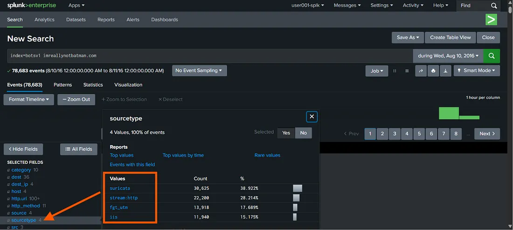

Looking at the **stream** sourcetype, we notice that most of the HTTP requests originate from the IP address **40.80.148.42**.

To determine whether this host is responsible for the suspicious activity, we need to examine the events in greater detail.

```spl
index=botsv1 imreallynotbatman.com sourcetype="stream:http"
```

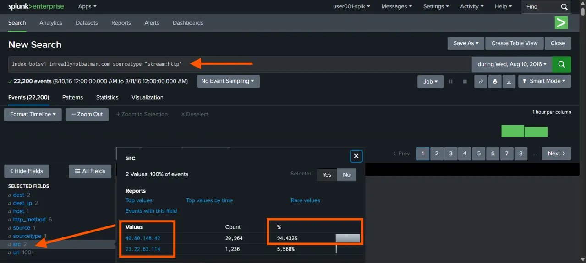

---

## 2. Investigate the Suricata Events

Next, let’s look at the **suricata** sourcetype. Here, we observe that the same IP is generating a large number of requests to the destination **192.168.250.70**, which is the IP address of our domain (**imreallynotbatman.com**).

```spl
index=botsv1 imreallynotbatman.com sourcetype="suricata"
```

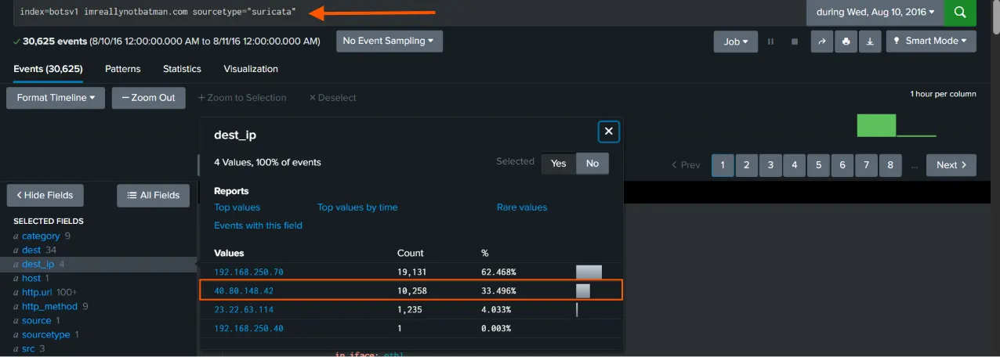

---

## 3. Investigate HTTP POST Requests

Let’s investigate further:

```spl
index=botsv1 sourcetype="stream:http" dest=192.168.250.70 http_method=POST
```

### Query Breakdown

- `index=botsv1` — Index of interest
- `sourcetype="stream:http"` — HTTP traffic captured by the stream HTTP sourcetype
- `dest=192.168.250.70` — Destination IP address of the domain
- `http_method=POST` — HTTP POST requests, where data is being submitted to the web server

We can then examine the `form_data` field:

```spl
index=botsv1 sourcetype="stream:http" dest=192.168.250.70 http_method=POST form_data=*
| table form_data
```

The **form_data** field contains the values submitted through web forms. If a brute-force attack is taking place, we would expect to find usernames and passwords being repeatedly submitted in this field.

To retrieve all events containing data in the `form_data` field, we use:

```spl
form_data=*
```

Examining the results, we can see that the **username** parameter is followed by values such as **user** and **admin**. Further along in the same string, we also find the **passwd** parameter, which contains the submitted password.

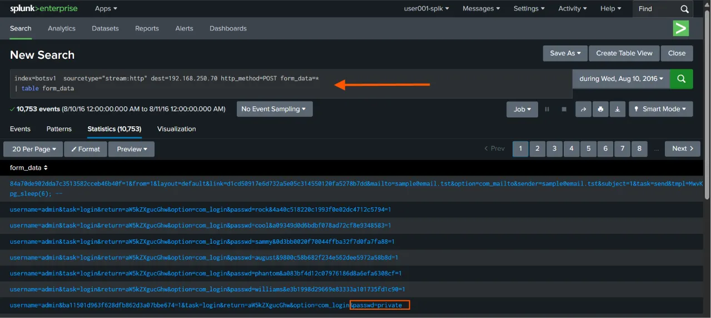

---

## 4. Narrow the Search to Username and Password Submissions

To narrow our search to events containing both username and password fields, we can add the following condition to our original search:

```spl
form_data=*username*passwd*
```

```spl
index=botsv1 sourcetype="stream:http" dest=192.168.250.70 http_method=POST form_data=*username*passwd*
| table form_data
```

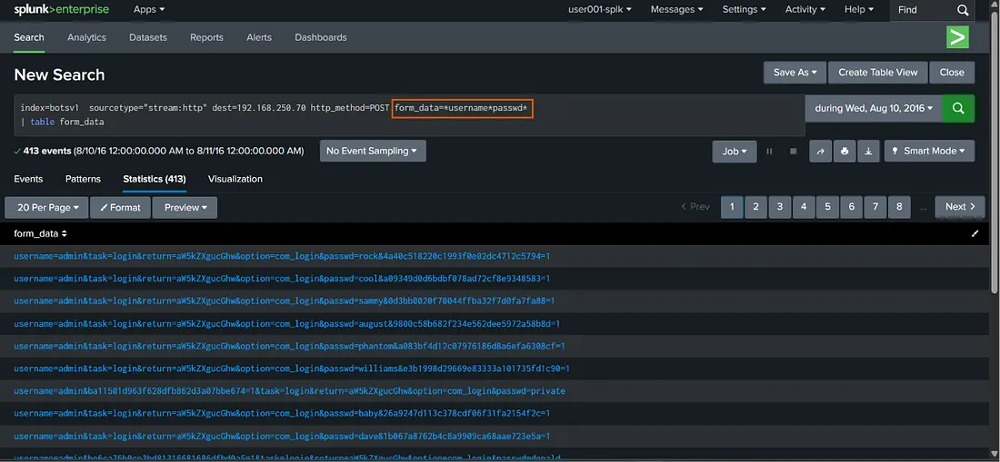

The results above confirm that these events contain both the **username** and **passwd** fields. We can also observe that this activity is occurring repeatedly.

The next step is to identify the source IP address responsible for these repeated login attempts.

```spl
index=botsv1 sourcetype="stream:http" dest=192.168.250.70 http_method=POST form_data=*username*passwd*
| table form_data src
```

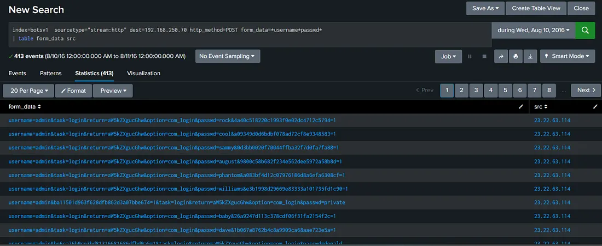

---

## 5. Identify the Source IP Responsible for the Attempts

The following command helps us identify the IP address responsible for the highest number of attempts.

```spl
index=botsv1 sourcetype="stream:http" dest=192.168.250.70 http_method=POST form_data=*username*passwd*
| table form_data src
| stats count by src
```

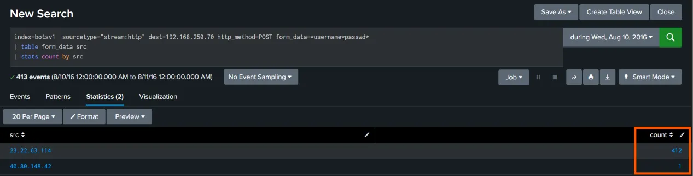

The results show that **23.22.63.114** generated the overwhelming majority of the observed username/password submission events, while **40.80.148.42** accounts for only a small number.

This gives us an important lead for the brute-force investigation.

---

## 6. Extract the Submitted Passwords

To extract only the password from the **form_data** string, we use the `rex` command:

```spl
| rex field=form_data "passwd=(?<userpassword>\w+)"
```

### `rex` Breakdown

- `field=form_data` — Specifies the field in which Splunk should look.
- `passwd` — Specifies the pattern we are looking for.
- `(?<userpassword>...)` — Creates a named field called `userpassword` from the captured value.
- `\w+` — Captures one or more word characters, such as letters, numbers, and underscores, until a non-word character is encountered.

We can then use the following search:

```spl
index=botsv1 sourcetype="stream:http" dest=192.168.250.70 http_method=POST form_data=*username*passwd*
| rex field=form_data "passwd=(?<userpassword>\w+)"
| table form_data userpassword
```

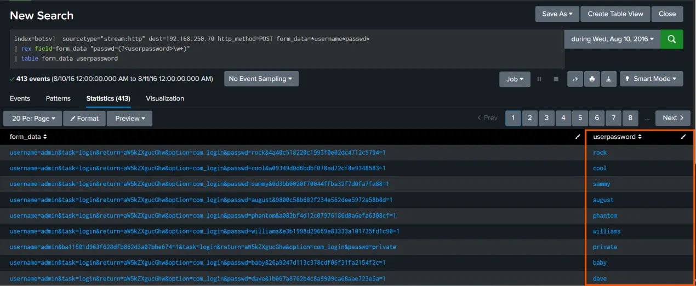

---

## 7. Identify the Password That Was Most Likely Successful

At this stage, we need to confirm that this is a true positive by identifying the password that successfully authenticated.

During a brute-force attack, most passwords are attempted only once, while a successful password is often retried. After extracting the passwords and sorting them by count, we observe that the password **batman** for the **admin** account appears twice, indicating that it was most likely the valid password.

```spl
index=botsv1 sourcetype="stream:http" dest=192.168.250.70 http_method=POST form_data=*username*passwd*
| rex field=form_data "passwd=(?<userpassword>\w+)"
| stats count values(src) by userpassword
| sort - count
```

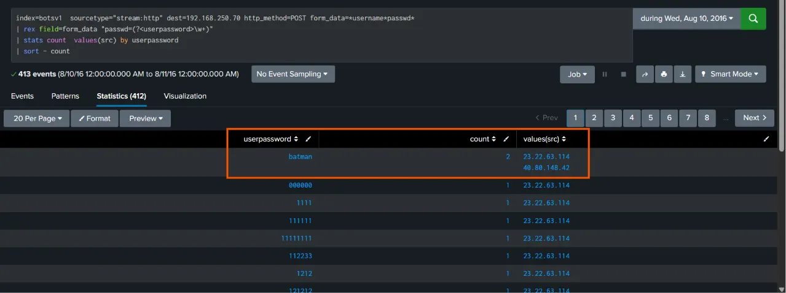

The results indicate that the brute-force activity came primarily from **23.22.63.114**, but it appears that the actual login with the correct password came from **40.80.148.42**.

This distinction is important because it suggests that the IP responsible for the password-guessing activity is not necessarily the same IP that later used the valid credentials.

---

## 8. Determine the Timing of the Successful Password Attempts

Next, we determine how much time elapsed between the first time the password **batman** was observed and the next time it appeared.

```spl
index=botsv1 sourcetype="stream:http" dest=192.168.250.70 http_method=POST form_data=*username*passwd*
| rex field=form_data "passwd=(?<userpassword>\w+)"
| search userpassword=batman
| table _time userpassword src
```

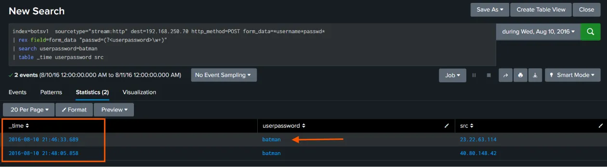

The results show two occurrences of the `batman` password, including the source IP associated with each event. This helps correlate the repeated password with the change in source IP observed during the investigation.

---

## 9. Identify the Geographic Location of the Source IPs

Finally, we identify the geographical location of the source IP addresses involved in the attack.

```spl
index=botsv1 sourcetype="stream:http" dest=192.168.250.70
| stats count by src
| iplocation src
| table src count City Region Country lat lon
```

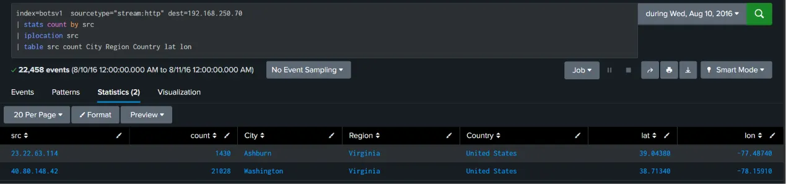

The results provide the approximate geographic information associated with the source IP addresses, including city, region, country, latitude, and longitude.

In this dataset, the observed source IPs resolve to locations in **Virginia, United States**.

---

## Findings and Observations

After gathering the relevant information during the initial investigation, we can summarize the important observations:

- The investigated domain was **imreallynotbatman.com**.
- The domain's destination IP observed in the investigation was **192.168.250.70**.
- Repeated HTTP POST requests were observed against the web server.
- The requests contained both `username` and `passwd` parameters in `form_data`.
- **23.22.63.114** generated the overwhelming majority of the observed login attempts.
- The password **batman** appeared twice in the extracted password values.
- The two `batman` observations were associated with different source IPs.
- **40.80.148.42** was associated with the other `batman` event and appears to have been involved in the subsequent login using the correct password.
- The source IPs were geolocated to Virginia, United States, within the BOTS dataset.

Based on these observations, the activity is consistent with a **brute-force authentication attempt followed by a likely successful authentication**.

---

## What Happens Next?

After gathering all the relevant information during our initial investigation, we document our findings, block the malicious IP addresses where appropriate, and escalate the incident to the Incident Response team for further investigation and remediation.

Once the incident is escalated, the Incident Response team investigates the full scope of the attack by confirming whether the attacker successfully authenticated, identifying compromised accounts, and reviewing relevant logs for any signs of unauthorized activity.

If an account is compromised:

- Passwords are reset.
- Active sessions are terminated.
- Security controls such as firewall rules and multi-factor authentication are strengthened.
- Relevant logs are preserved for further investigation.
- The incident is documented for root cause analysis and future prevention.

Finally, the team recommends improvements such as:

- Stronger password policies
- Account lockout mechanisms
- Multi-factor authentication
- Enhanced monitoring and alerting
- Appropriate network blocking and access controls

These measures can help reduce the likelihood and impact of similar brute-force attacks in the future.

---

## Conclusion

This investigation demonstrates how Splunk can be used to move from a broad set of HTTP events to a focused investigation of repeated authentication attempts.

By examining sourcetypes, filtering HTTP POST requests, inspecting `form_data`, identifying source IP addresses, extracting password values with `rex`, and correlating timestamps, we were able to build a timeline of the suspected brute-force activity and identify the password that was most likely used successfully.

The investigation also highlights an important SOC principle: **do not stop after identifying repeated failed attempts**. The analyst should determine whether any credential was eventually successful and investigate the source of that successful authentication.

---

## Note on the Dataset and Attribution

This blog is inspired by the **Splunk Boss of SOC (BOTS)** dataset and tutorial, with explanations and walkthroughs presented in my own words.

The Splunk BOTS dataset is used here as an authorized cybersecurity training environment. The investigation, commands, observations, and explanations in this write-up are presented as part of that educational analysis.

