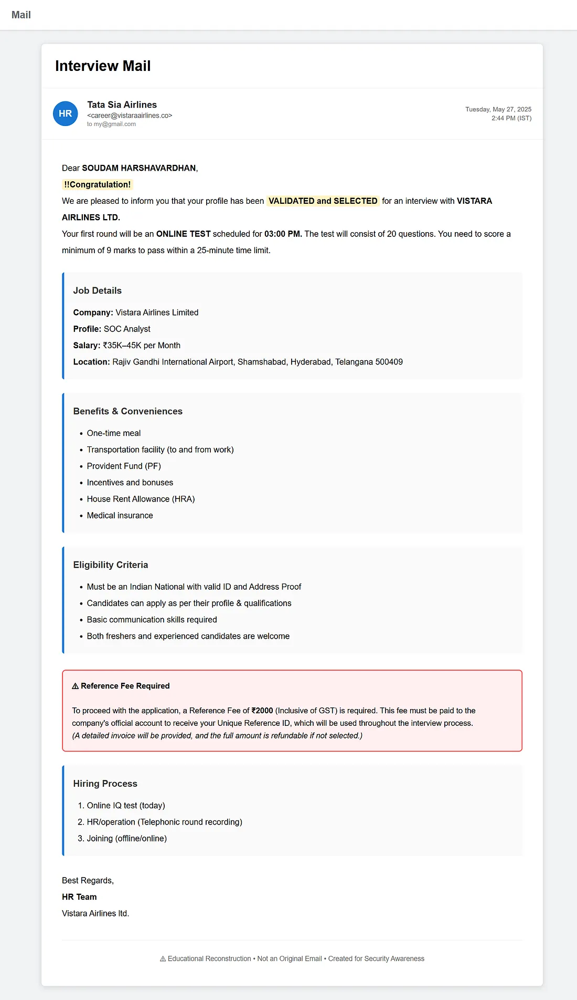
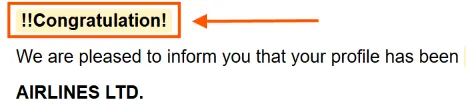
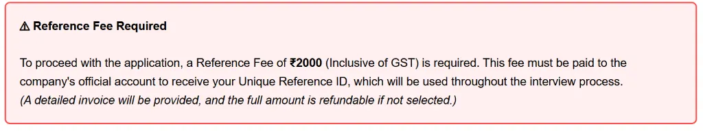

# Investigating a Phishing Email: A Step-by-Step Analysis

## I Almost Fell for This “Dream Job” Scam — Here’s How I Analyzed It

If you’ve ever been searching for a job, you know the excitement of seeing an email with the subject **“Interview Mail.”** That excitement can make us overlook details we would normally question.

Recently, while reviewing my inbox, I came across what looked like a genuine interview invitation. At first glance, everything seemed convincing — a well-known airline, an attractive salary package, employee benefits, and an immediate online test. But as someone interested in cybersecurity, I decided to treat it like an incident and investigate it instead of reacting emotionally.

In this blog, I’ll walk you through my thought process and explain how I identified multiple red flags that revealed this email to be a phishing attempt.

> **Note:** The original phishing email has since been deleted. The screenshots included in this article are illustrative recreations based on the email’s contents.

---

## The Email

The sender claimed to represent **Vistara Airlines** and invited me to interview for a **SOC Analyst** position.

Some of the details included:

- Position: SOC Analyst
- Salary: ₹35,000–₹45,000 per month
- Location: Hyderabad
- Online IQ Test
- Employee benefits
- Immediate hiring process

Everything looked professional until I started examining the email closely.

---

## Red Flag 1: The Subject Creates Urgency

The subject simply reads:

**“Interview Mail”**

Most legitimate companies use descriptive subject lines containing a job ID, candidate name, or interview schedule. Generic subjects are common in phishing campaigns because they are easy to send to thousands of recipients.

---

## Red Flag 2: Emotional Manipulation

The email begins with:

> ***!!Congratulation!***

and immediately says that my profile has already been **“VALIDATED and SELECTED.”**

This is a classic social engineering tactic.

Instead of giving you time to think, the attacker makes you feel successful before you’ve even attended an interview.

When emotions take over, logical thinking usually takes a back seat.

---

## Red Flag 3: Too Good to Be True

The email promises:

- Attractive salary
- Transportation
- Meals
- Medical insurance
- PF
- Incentives
- HRA

None of these are unusual individually.

However, combining all these benefits with immediate selection and a very low qualification requirement is intended to make the offer difficult to ignore.

---

## Red Flag 4: Poor Grammar

The email contains several grammatical mistakes:

- “Congratulation!”
- Random capitalization
- Inconsistent formatting
- Unprofessional punctuation

Large organizations usually have HR templates that are reviewed before being sent.

Small mistakes don’t always indicate phishing, but multiple mistakes together should increase suspicion.

---

## Red Flag 5: The Biggest Indicator — They Ask for Money

This is where the scam becomes obvious.

The email states:

> ***A Reference Fee of ₹2000 is required before receiving your Reference ID.***

Legitimate companies do **not** ask candidates to pay money simply to participate in an interview process.

The promise that the amount is **“fully refundable”** is another common trick used to gain trust.

Whenever a recruiter asks for money before recruitment, it should immediately raise suspicion.

---

## Red Flag 6: Creating Urgency

The hiring process is described as:

- Online IQ Test (Today)
- HR Round
- Joining

Everything is expected to happen almost immediately.

Attackers intentionally create urgency so that victims don’t have enough time to verify the legitimacy of the email.

---

## Red Flag 7: The Sender’s Email Address

The sender appears as:

> `carrer@vistaraairlines.co`

This is one of the first things I verify during email analysis.

The sender domain is `vistaraairlines.co`. The actual corporate domain for Vistara was `airvistara.com` before its merger into Air India. This is a textbook example of typosquatting/look-alike domain registration.

Cybercriminals often register domains that closely resemble legitimate organizations to trick recipients.

Even if the sender’s display name appears legitimate, always verify the actual email address and domain before responding.

---

## Red Flag 8: Failed DMARC Authentication

As part of the investigation, I checked the email authentication results. The email **failed the DMARC (Domain-based Message Authentication, Reporting, and Conformance) check**, indicating that the sender’s domain could not be properly authenticated.

Although a failed DMARC check alone does not confirm an email is malicious, it is a strong indicator of email spoofing or unauthorized sending. Combined with the other red flags identified during this analysis, it provides strong evidence that this email is a phishing attempt.

---

## Conclusion

This email is an excellent example of how phishing attacks don’t always rely on malware. Sometimes, all an attacker needs is **curiosity, excitement, and urgency**.

The email looks convincing because it uses a trusted company name, promises a desirable job, and pressures the recipient into making a quick financial decision.

As cybersecurity professionals, we should develop the habit of slowing down, verifying every detail, and questioning anything that asks us to act immediately.

---

## Responsible Disclosure

After analyzing the email, I reported the incident to Air India’s privacy team at **data.privacy@airindia.com** so they could review the suspicious message.

The original phishing email has since been deleted, so the screenshots in this article are illustrative recreations based on the email’s contents.

---

## Key Takeaways

When analyzing a suspicious recruitment email, check for:

1. **Generic or unusual subject lines**
2. **Unsolicited congratulations or immediate selection**
3. **Pressure to act quickly**
4. **Unusually attractive salary or benefits**
5. **Grammar and formatting inconsistencies**
6. **Requests for registration, reference, interview, or processing fees**
7. **Look-alike or suspicious sender domains**
8. **Email authentication failures such as DMARC**
9. **Claims that are difficult to independently verify**

Most importantly, **never send money simply because an email claims that payment is required to continue a recruitment process**.

---

## Disclaimer

This article is presented for cybersecurity awareness and educational purposes. The analysis describes a suspicious recruitment email and the indicators used to identify it as a phishing attempt.

The screenshots are illustrative recreations based on the original email because the original phishing email was subsequently deleted.
