# Investigating a Cerber Ransomware Attack Using Splunk

## Introduction

Ransomware continues to be one of the most disruptive cyber threats organizations face today.

A single careless action by an employee can quickly escalate into an organization-wide incident, impacting business operations and potentially causing significant financial losses.

In this investigation, we will analyze a ransomware attack using Splunk’s BOTS v1 dataset. We will follow the attack from the initial infection vector through malware execution and network activity to file encryption and finally identify the indicators of compromise (IOCs) associated with the Cerber ransomware.

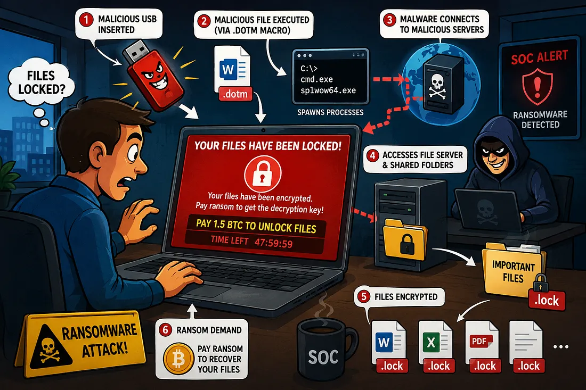

> **Lab / Educational Context:** This investigation uses the Splunk BOTS v1 dataset as an authorized cybersecurity training environment.

---

## Scenario

On **24 August 2016**, an employee named **Bob Smith** discovered a USB flash drive in the company parking lot. Curious about its contents, he plugged it into his corporate workstation.

A short time later, the IT helpdesk began receiving numerous complaints:

- Employees were unable to access files on shared folders.
- Many documents could no longer be opened.
- Files had suddenly changed to the **`.lock`** extension.
- Users were presented with a ransom message demanding payment to recover their files.

Recognizing the signs of a ransomware outbreak, the incident was immediately escalated to the Security Operations Center (SOC). The SOC team began investigating to identify the source of the attack, understand its impact, and collect evidence for containment and remediation.

The affected workstation was identified with the hostname **`we8105desk`**.

---

## Step 1 — Identify the Victim’s IP Address

We begin by searching for the victim hostname throughout the environment.

```spl
index=botsv1 we8105desk
```

After reviewing the event distribution, the sourcetype containing the highest number of events is selected for deeper investigation.

From the **Selected Fields**, the **`src_ip`** field consistently shows:

> `192.168.250.100`

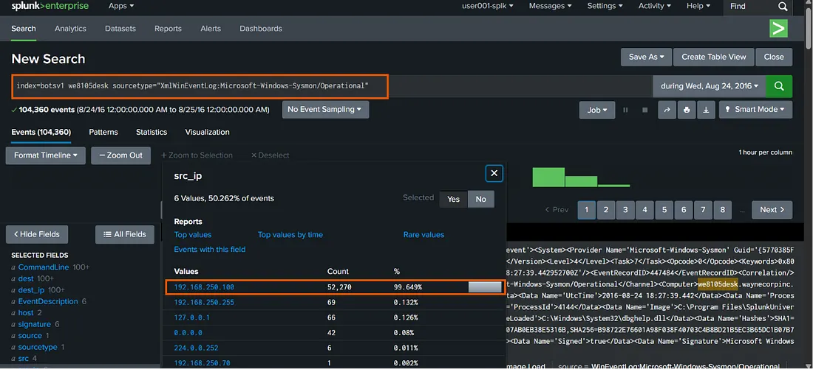

---

## Step 2 — Identify the USB Device

Since the attack started immediately after Bob inserted the USB drive, the next objective is identifying the device.

Search Windows Registry events:

```spl
index=botsv1 sourcetype=winregistry friendlyname
```

The **`registry_value_data`** field contains the friendly name of the inserted USB device, confirming the removable media used during the initial compromise.

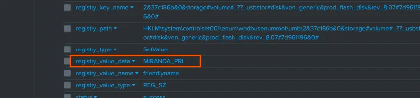

For improved readability:

```spl
index=botsv1 sourcetype=winregistry friendlyname
| table _time host user object data
```

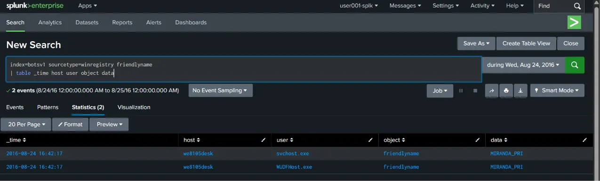

---

## Step 3 — Investigate Initial Malware Execution

After confirming the USB insertion, the next step is determining what executable launched from the removable drive.

Since the organization’s workstation only contains the primary **C:** drive, any executable launched from **D:** is highly suspicious.

Search for executions from the USB drive:

```spl
index=botsv1 sourcetype="xmlwineventlog:microsoft-windows-sysmon/operational" host="we8105desk" "d:\\"
| reverse
```

To focus specifically on command-line executions:

```spl
index=botsv1 sourcetype="xmlwineventlog:microsoft-windows-sysmon/operational"
host="we8105desk"
(CommandLine="*d:\\*" OR ParentCommandLine="*d:\\*")
| table _time CommandLine ParentCommandLine
| sort _time
```

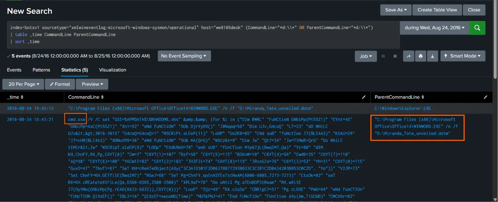

The investigation reveals the following execution:

> `"C:\Program Files (x86)\Microsoft Office\Office14\WINWORD.EXE"`  
> `/n /f "D:\Miranda_Tate_unveiled.dotm"`

This indicates that Microsoft Word opened a document template located on the USB drive.

The file extension **`.dotm`** represents a Microsoft Word Macro-Enabled Template.

Unlike standard Word documents, `.dotm` files can contain embedded VBA macros. Threat actors frequently abuse these templates to execute malicious code once the victim opens the document.

Shortly after execution, two additional processes are spawned:

- `cmd.exe`
- `splwow64.exe`

This strongly suggests that the malicious macro executed system commands to continue the infection chain.


---

## Step 4 — Determine Whether the Victim Accessed a File Server

The next objective is determining whether the ransomware spread to a shared network drive.

Review Sysmon events for network connections:

```spl
index=botsv1 sourcetype="xmlwineventlog:microsoft-windows-sysmon/operational"
host="we8105desk"
```

Examining the **`src`** field shows that the workstation is identified as:

> `we8105desk.waynecorpinc.local`

```spl
index=botsv1 sourcetype="xmlwineventlog:microsoft-windows-sysmon/operational"
host="we8105desk"
src="we8105desk.waynecorpinc.local"
| stats count by dest_ip
| sort -count
```

Two internal IP addresses receive the majority of the connections.

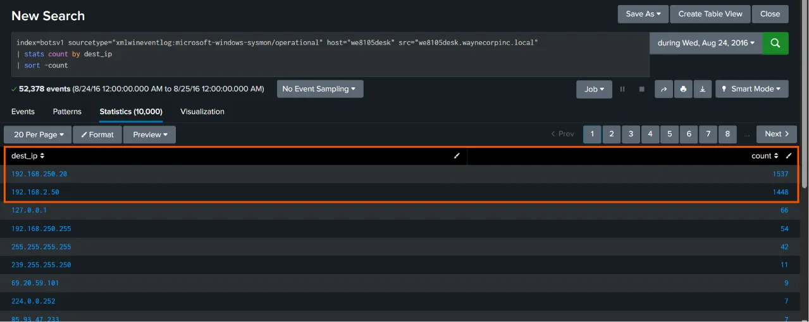

To determine which IP belongs to the file server, pivot to Windows Registry events.

```spl
index=botsv1 sourcetype="winregistry" host="we8105desk" explorer
| stats count by registry_key_name
| sort - count
```


This confirms the file server IP as **192.168.250.20**.

To identify its hostname:

```spl
index=botsv1 sourcetype="xmlwineventlog:microsoft-windows-sysmon/operational"
192.168.250.20
```

Reviewing the `src`, `dvc_nt_host`, and `dest_host` fields consistently reveals:

> **`we9041srv`**

---

## Step 5 — Identify the First Suspicious Domain

Now we investigate the victim’s DNS activity.

After excluding normal Microsoft traffic and performing basic DNS lookup on the results, the earliest suspicious DNS request is:

> **`solidaritedeproximite.org`**

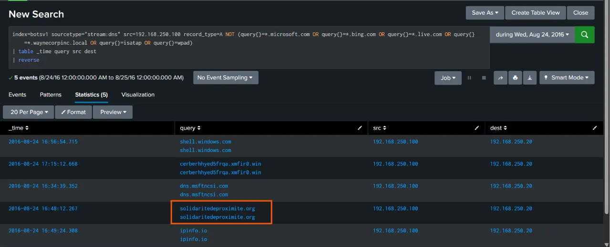

This domain becomes an important indicator for the investigation because it appears during the period surrounding the initial compromise.

---

## Step 6 — Identify the Cerber Payload

Cerber ransomware downloads an additional payload before beginning file encryption.

Inspect HTTP traffic:

```spl
index=botsv1 sourcetype="stream:http" src="192.168.250.100"
| stats count values(url) by dest
| reverse
```

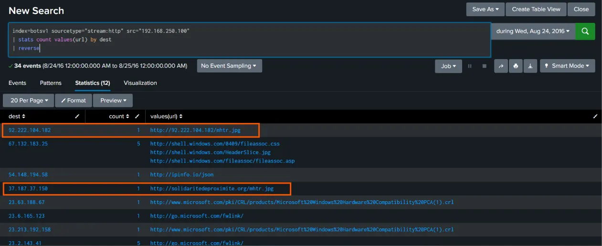

Two external servers host an unusual file named **`/mhtr.jpg`**.

Although it appears to be a JPEG image, this filename is well-known within threat intelligence reports related to Cerber ransomware.

To further validate this activity:

```spl
index=botsv1 sourcetype="suricata" src="192.168.250.100" url=*
| stats count values(url) by dest
```

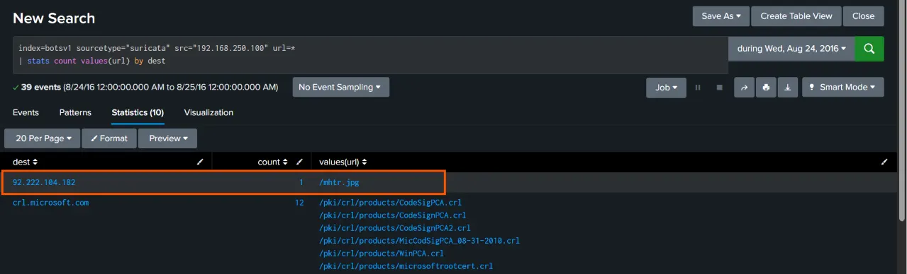

The Suricata logs confirm the same suspicious download.

Researching **`mhtr.jpg`** in public threat intelligence sources links the file directly to known Cerber ransomware campaigns.

---

## Step 7 — Validate Using Firewall Logs

To confirm the download from another security data source, examine the firewall logs.

```spl
index=botsv1 sourcetype=fgt_utm src="192.168.250.100" mhtr.jpg
| table _time src dest msg url action
```

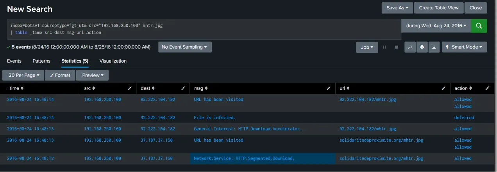

The firewall logs clearly show the download activity.

Looking deeper:

```spl
index=botsv1 sourcetype=fgt_utm src="192.168.250.100" app="Cerber.Botnet"
| reverse
```

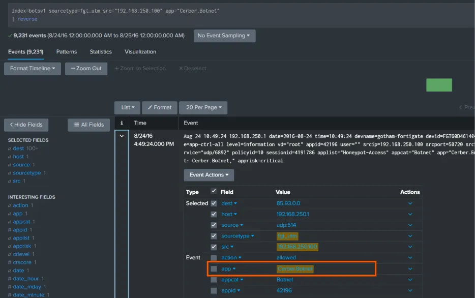

This provides strong confirmation that the workstation was infected with Cerber ransomware.

---

## Step 8 — Measure the Impact

### Number of Local Text Files Encrypted

```spl
index=botsv1 sourcetype="xmlwineventlog:microsoft-windows-sysmon/operational" host="we8105desk" EventCode=2 TargetFilename="C:\\Users\\bob.smith.WAYNECORPINC\\*.txt"
| stats dc(TargetFilename)
```

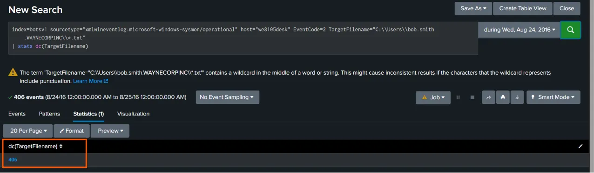

The `dc()` function counts the number of unique encrypted text files on Bob's workstation.

### Number of PDF Files Encrypted on the File Server

```spl
index=botsv1 sourcetype=*win* pdf dest=we9041srv.waynecorpinc.local Source_Address=192.168.250.100
| stats dc(Relative_Target_Name)
```

This search calculates how many PDF files on the shared file server were encrypted by the infected workstation.

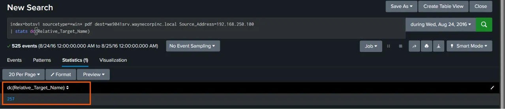

---

## Step 9 — Identify the Ransom Payment Domain

Cerber attempts to redirect victims to a payment portal after encryption is complete.

Search the DNS logs again while filtering known legitimate domains.

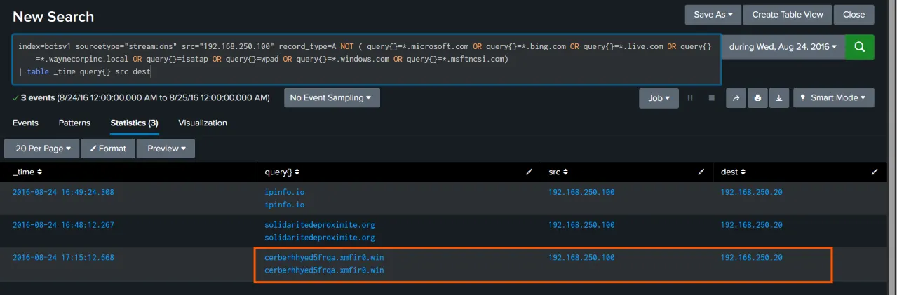

The ransomware attempts to resolve:

> **`cerberhhyed5frqa.xmfir0.win`**

This domain is used by Cerber to direct victims to its ransom payment portal.

---

## Indicators of Compromise (IOCs)

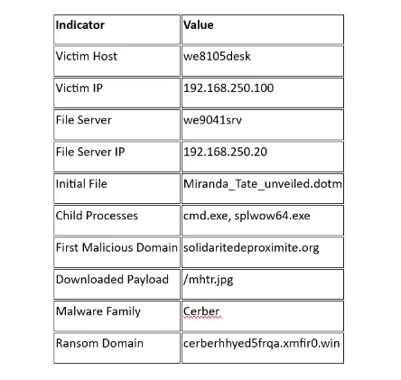

The investigation identifies the following indicators from the provided evidence:

| Indicator | Value |
|---|---|
| Victim hostname | `we8105desk` |
| Victim IP | `192.168.250.100` |
| File server IP | `192.168.250.20` |
| File server hostname | `we9041srv` |
| Initial suspicious domain | `solidaritedeproximite.org` |
| Suspicious payload | `/mhtr.jpg` |
| Ransom/payment domain | `cerberhhyed5frqa.xmfir0.win` |
| Malware | Cerber ransomware |
| Suspicious source / payload activity | `192.168.250.100` |

> **Important:** The IOC table above only records indicators explicitly present in the supplied article text. No additional hashes, IPs, domains, or file indicators have been invented.

---

## Attack Chain Summary

Based on the investigation, the observed attack chain can be summarized as:

```text
USB device discovered
        ↓
USB inserted into corporate workstation
        ↓
Macro-enabled Word template opened
        ↓
WINWORD.EXE executes the .dotm file
        ↓
cmd.exe / splwow64.exe spawned
        ↓
Suspicious DNS activity
        ↓
Cerber payload downloaded as /mhtr.jpg
        ↓
Suricata + firewall telemetry confirms activity
        ↓
Cerber ransomware execution
        ↓
Local files encrypted
        ↓
Shared file-server files encrypted
        ↓
Victim directed toward Cerber payment infrastructure
```

---

## SOC Analyst Response

After confirming the ransomware infection, the SOC analyst’s first priority is to **isolate the infected workstation `we8105desk`** to stop further encryption and prevent lateral movement.

Next, the identified **malicious domains, IP addresses, file hashes, and payloads** should be blocked across security controls such as:

- Firewalls
- DNS filtering
- Proxies
- Endpoint protection

The analyst should then:

1. Identify any **additional affected systems**.
2. Document all **Indicators of Compromise (IOCs)**.
3. Prepare a complete timeline of the attack.
4. Preserve relevant evidence and logs.
5. Escalate the incident to the **Incident Response (IR) team**.
6. Support containment, eradication, recovery, and forensic analysis.

Following recovery, a **lessons learned** review should be conducted to strengthen security controls, such as:

- Restricting unauthorized USB devices
- Disabling Office macros where appropriate
- Improving endpoint protection
- Increasing employee security awareness
- Strengthening network monitoring
- Improving ransomware detection and response procedures

These controls can help prevent or reduce the impact of similar ransomware attacks in the future.

---

## Conclusion

This investigation demonstrates how a SOC analyst can use multiple security data sources in Splunk to reconstruct a ransomware attack.

Starting with the affected workstation, we identified the victim IP address, traced the initial USB-based infection vector, investigated the malicious Word macro execution, identified network communication with suspicious infrastructure, validated the payload through HTTP, Suricata, and firewall telemetry, measured the resulting file encryption, and identified the Cerber payment infrastructure.

The investigation also demonstrates the value of **correlating multiple sources of telemetry** rather than relying on a single alert. Registry events, Sysmon logs, DNS activity, HTTP traffic, Suricata events, and firewall logs each provided a different piece of the attack story.

---

## Dataset / Attribution

This investigation uses the **Splunk Boss of the SOC (BOTS) v1 dataset** as the underlying cybersecurity training environment.

The investigation walkthrough and explanations are presented in my own words. The BOTS challenge/dataset itself is not claimed as original work.

> **Educational and authorized-use note:** The commands and analysis in this article are intended for the supplied BOTS training dataset or other systems where the analyst has explicit authorization to investigate.
