# The Packets Told the Story: Hunting a RIG Exploit Kit Infection with Wireshark

## Where Network Traffic Becomes Evidence

Malware analysis does not always begin with a suspicious executable sitting on an analyst’s desktop. Sometimes, all we have is network traffic: thousands of packets containing DNS queries, HTTP requests, server responses, redirects, and file transfers. Hidden among all that legitimate-looking activity can be enough evidence to reconstruct an entire malware infection.

In this investigation, I will analyze the **2014–11–16 traffic analysis exercise from Malware-Traffic-Analysis.net** using Wireshark. Instead of treating the exercise as a list of questions and answers, I will approach it as if a suspicious PCAP has arrived at a SOC and I have been asked to determine what happened.

We will identify the infected Windows machine, trace the compromised website, uncover a hidden redirect, investigate the Exploit Kit traffic, extract exploit files, and finally reconstruct the complete attack chain.


---

## Scenario: A Suspicious PCAP Lands on Your Desk

Imagine you are a SOC analyst investigating suspicious network activity. A Windows workstation may have been infected while browsing the web, but the affected machine, infection source, and malware delivery method are unknown. The only evidence available is a **PCAP file containing thousands of network packets**.

Using Wireshark, our goal is to reconstruct the incident step by step:

**Identify the victim → Find the compromised website → Discover the redirect → Trace the exploit kit → Analyze the exploits → Identify the payload**

### Opening the PCAP in Wireshark

After loading the PCAP into Wireshark, the first thing we see is a large amount of network traffic. Trying to inspect every packet individually would be inefficient, so the investigation should begin by reducing the noise and identifying useful protocols.

Because the scenario involves web browsing and an Exploit Kit, HTTP traffic is particularly important. A useful starting filter is:

```wireshark
http.request
```

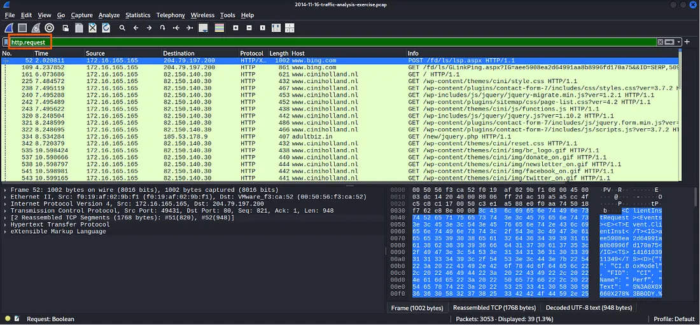

---

# LEVEL 1 — Initial Triage and Victim Identification

Level 1 represents the initial triage stage of our investigation. Before determining which malware was involved, a SOC analyst needs to establish the identity of the affected endpoint and the infrastructure associated with the suspicious traffic.

## Question 1: What is the IP address of the Windows VM that gets infected?

While examining the traffic, one internal IP address repeatedly appears in the web activity associated with the infection:

> **172.16.165.165**


In a real SOC investigation, identifying the affected IP gives us a pivot point for searching firewall logs, DNS records, proxy logs, SIEM events, and endpoint telemetry.

---

## Question 2: What is the host name of the Windows VM that gets infected?

Windows systems can reveal identifying information through several network protocols. In this capture, **DHCP** provides an easy way to associate the victim’s IP address with its hostname.

**Filter:**

```wireshark
dhcp
```

**Answer:**

> **K34EN6W3N-PC**

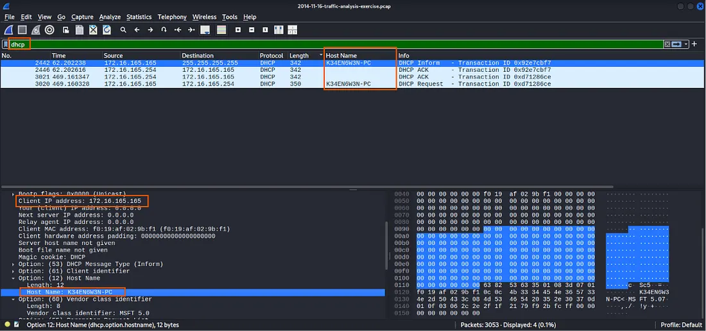

---

## Question 3: What is the MAC address of the infected VM?

We have identified the victim’s IP address and hostname, but there is another useful network identifier available inside the **Ethernet frames**: the **MAC address**.

By selecting traffic associated with **172.16.165.165** and expanding the **Ethernet II** section in Wireshark, we can identify the victim’s MAC address as:

> **f0:19:af:02:9b:f1**


At this point, we have built our first mini-profile of the affected endpoint. The victim is no longer an unknown machine. We now know exactly which endpoint we are following through the rest of the PCAP.

---

## Question 4: What is the IP address of the compromised website?

With the victim identified, the next objective is to determine where the suspicious browsing activity began.

Examining HTTP requests from **172.16.165.165** reveals communication with a web server.

**Compromised website IP address:**

> **82.150.140.30**


At this stage, it is important not to immediately label every server contacted by an infected machine as malicious. A compromised website may originally be legitimate but contain unauthorized code injected by an attacker. We therefore need to identify the corresponding domain and inspect what the website delivered.

---

## Question 5: What is the domain name of the compromised website?

An IP address tells us which server was contacted, but HTTP traffic can also reveal the domain requested by the browser. Expanding the **Hypertext Transfer Protocol** section of the relevant packet allows us to inspect the **Host** header.

The domain is:

> **www.ciniholland.nl**

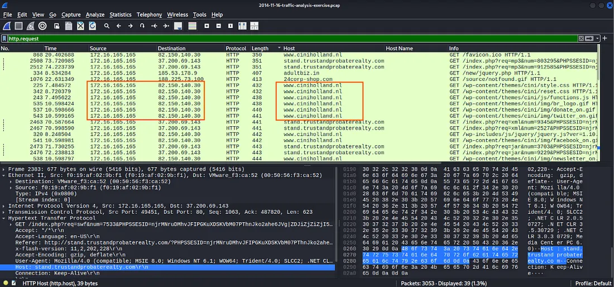

---

## Question 6: What is the IP address and domain name that delivered the exploit kit and malware?

Following the victim’s HTTP conversations reveals communication with another server at:

> **37.200.69.143**

The associated domain is:

> **stand.trustandprobaterealty.com**

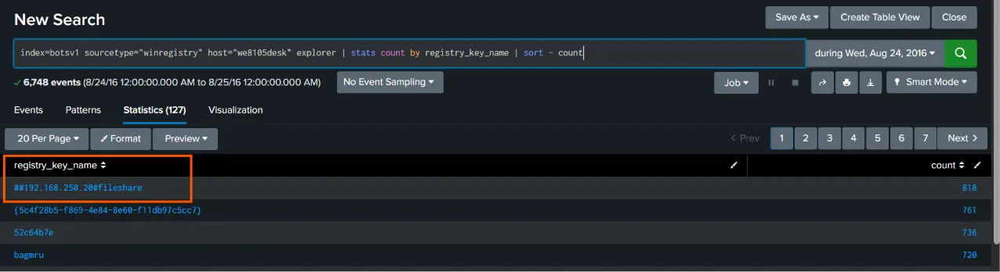

We can now see the beginning and end of an important part of the attack chain. The victim contacted **www.ciniholland.nl**, and later the browser communicated with **stand.trustandprobaterealty.com**.

What we have not yet established is exactly **how the browser moved between those two stages**.

---

## Question 7: What is the domain name that delivered the exploit kit and malware?

The domain responsible for delivering the Exploit Kit and malware is:

> **stand.trustandprobaterealty.com**

This confirms the domain associated with the malicious server identified in the previous question.

### Level 1 Findings


---

# LEVEL 2 — Following the Infection Trail

At this stage, imagine our SOC ticket contains several suspicious indicators but no complete explanation. We know which machine became infected and which servers were involved, but simply listing IP addresses does not tell us how the infection occurred.

Our next task is therefore to connect those indicators into a sequence of events.

---

## Question 1: What is the redirect URL that points to the Exploit Kit landing page?

The compromised website did not directly host every component of the attack. Instead, malicious content inside the website caused the victim’s browser to follow a redirect toward another location.

By examining the relevant HTTP traffic and following the TCP stream, we can identify the redirect URL as:

> **http://24corp-shop[.]com/**

**Filter:**

```wireshark
tcp.stream eq 18
```

Alternatively, the HTML object can be exported using:

**File → Export Object → HTTP**


This is an important turning point in the investigation. We can now explain how a visitor browsing **www.ciniholland.nl** was moved toward attacker-controlled infrastructure without intentionally navigating there.

### Following the TCP Stream

A useful technique in Wireshark is to select the relevant HTTP packet and use:

**Right-click → Follow → TCP Stream**

Instead of examining individual packets, **TCP Stream** reconstructs the conversation between the client and the server. This often makes HTTP redirects, scripts, URLs, and transferred content much easier to understand.

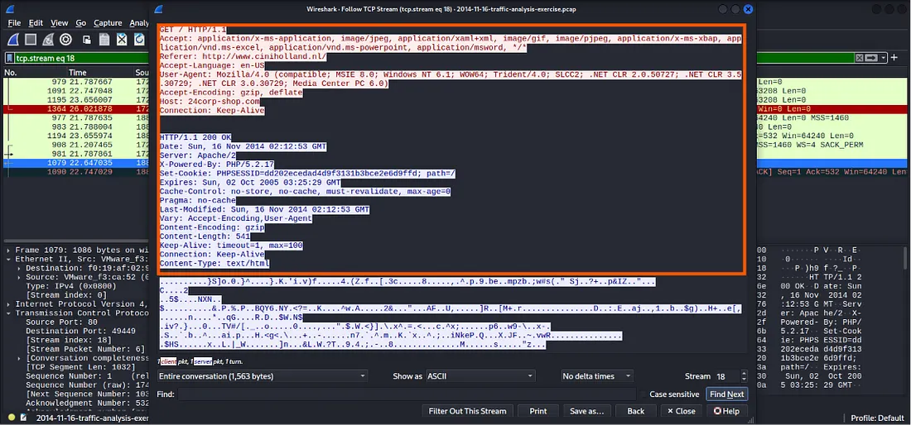

---

## Question 2: Besides the landing page (which contains the CVE-2013–2551 IE exploit), what other exploit(s) were sent by the EK?

The Exploit Kit landing page contains an Internet Explorer exploit targeting **CVE-2013–2551**, but the attack does not depend entirely on that vulnerability.

Further analysis shows additional exploit content targeting:

- **Adobe Flash**
- **Java**

Use:

**File → Export Objects → HTTP**

and show the suspicious objects that can be reconstructed from the capture.

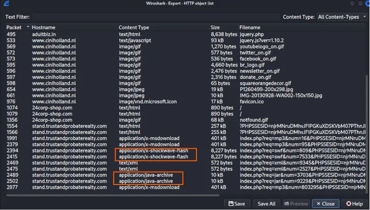

---

## Question 3: How many times was the payload delivered?

Reviewing the malicious HTTP traffic reveals that the payload was not delivered only once.

The capture shows **three payload deliveries**.

**Answer:**

> The payload was delivered **3 times**.

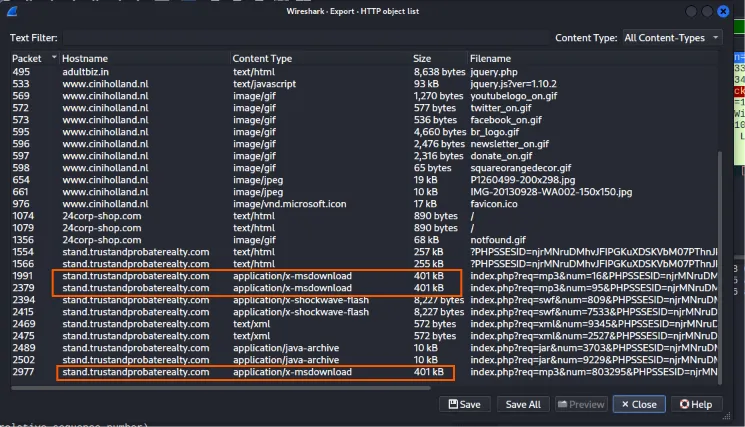

Repeated delivery is an interesting observation because seeing the same or similar malicious content multiple times does not automatically mean three separate computers were infected. It can represent retries or repeated delivery attempts within the same infection sequence.

---

## Question 4: Submit the PCAP to VirusTotal and find out what Snort alerts triggered. What EK names are shown in the Suricata alerts?

Network intrusion detection systems can analyze traffic patterns and compare them against known signatures.

When this historical PCAP is analyzed, the Suricata alerts reference Exploit Kit naming associated with:

- **Goon**
- **Infinity**
- **RIG**

**Answer:**

> Alerts reference **Goon / Infinity / RIG** Exploit Kit naming.

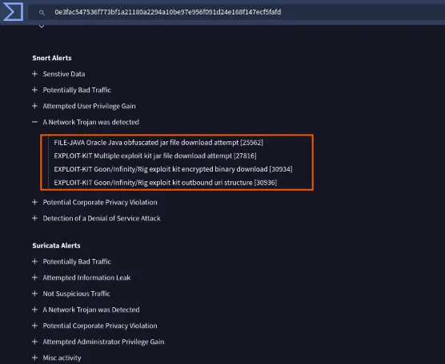

This illustrates an important point in threat intelligence: malware and Exploit Kit naming is not always consistent across researchers, vendors, and detection systems.

The same or related activity can appear under multiple names depending on the signature source and historical classification.

---

# LEVEL 3 — Digging Deeper into the Evidence

Level 3 requires a different mindset.

Until now, most of our conclusions came from network conversations: which system contacted which server, what domain appeared in an HTTP request, and what redirect was present in a response.

Now we will inspect the actual content transferred over the network. This allows us to identify the Exploit Kit more precisely, locate the malicious code inside the compromised website, extract exploit files, calculate hashes, and examine the Snort rules triggered by the traffic.

---

## Question 1: Checking the website, what have I and others been calling this Exploit Kit?

Although some detection signatures contain terminology such as **Goon** or **Infinity**, the Exploit Kit associated with this infection has commonly been referred to as:

> **RIG Exploit Kit (RIG EK)**

This is a useful reminder that signature names should not be treated as the only source of truth during an investigation.

Analysts should correlate network behavior, infrastructure, historical research, signatures, and extracted artifacts before deciding how to classify an incident.

---

## Question 2: What file or page from the compromised website has the malicious script with the URL for the redirect?

We already know that **www.ciniholland.nl** was compromised and that the browser was redirected toward **24corp-shop[.]com**.

The next question is whether we can identify where that redirect was actually placed.

Inspection of the content delivered by the compromised website shows that the malicious script is present in the website’s **index page**. This page contains the malicious reference responsible for pushing the browser into the next stage of the infection chain.

**Answer:**

> The **malicious script** is located in the **index page** of the compromised website.

Start with:

```wireshark
http.host == "www.ciniholland.nl"
```

You should find an HTTP request similar to a **GET** request for the site's root/index page.

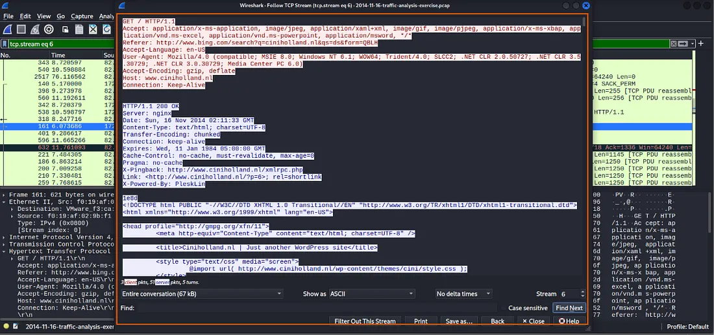

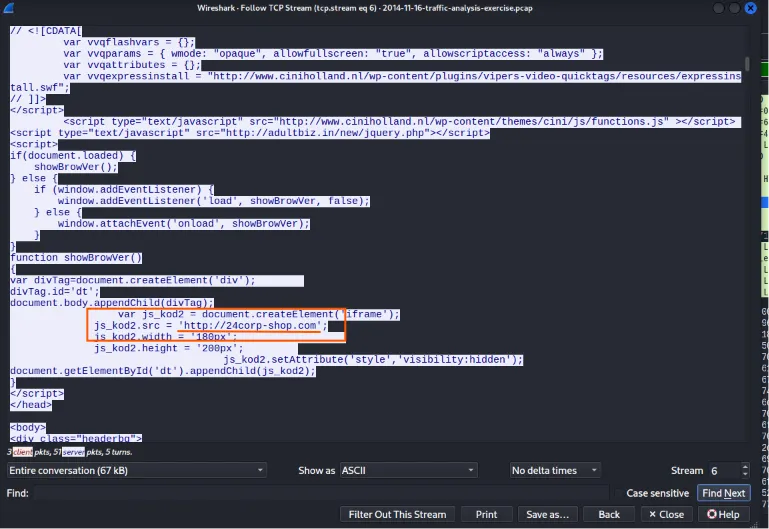

---

## Question 3: Extract the exploit file(s). What are the MD5 file hashes?

One of Wireshark’s most useful forensic capabilities is the ability to reconstruct certain files transferred over protocols such as HTTP.

Instead of only observing that a file moved across the network, we can sometimes extract that object and examine it separately.

In Wireshark, navigate to:

**File → Export Objects → HTTP**

The HTTP Objects window displays files and resources that Wireshark can reconstruct from the captured HTTP sessions. From here, the relevant exploit objects can be saved to an isolated analysis directory.

### Flash Exploit

**MD5:**

> `7b3baa7d6bb3720f369219789e38d6ab`

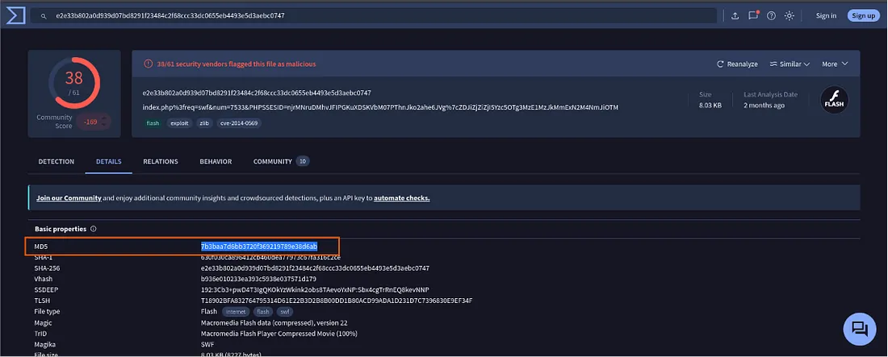

### Java Exploit

**MD5:**

> `1e34fdebbf655cebea78b45e43520ddf`


---

# Reconstructing the Complete Attack Chain

We began this investigation with a PCAP containing a large amount of network activity and no convenient explanation of what happened.

By correlating endpoint identifiers, HTTP requests, server responses, redirects, transferred files, and IDS signatures, we can now reconstruct the incident with much greater confidence.

The infected Windows VM was **K34EN6W3N-PC**, using IP address **172.16.165.165** and MAC address **f0:19:af:02:9b:f1**.

The machine accessed the compromised website **www.ciniholland.nl** at **82.150.140.30**.

Malicious content within the site’s index page redirected the browser through **24corp-shop[.]com**, eventually leading it toward the Exploit Kit infrastructure at **stand.trustandprobaterealty.com (37.200.69.143)**.

The Exploit Kit activity included the IE vulnerability **CVE-2013–2551**, along with additional Flash and Java exploit content.

The payload was delivered three times, while network detection signatures associated the activity with **Goon/Infinity/RIG** terminology.

Historical analysis of the infection identifies the Exploit Kit as **RIG EK**.

---

# Attack Chain at a Glance

```text
Windows VM
K34EN6W3N-PC
172.16.165.165
        │
        ▼
Compromised website
www.ciniholland.nl
82.150.140.30
        │
        ▼
Malicious script in index page
        │
        ▼
Redirect
24corp-shop[.]com
        │
        ▼
Exploit Kit infrastructure
stand.trustandprobaterealty.com
37.200.69.143
        │
        ├── CVE-2013–2551 / Internet Explorer
        ├── Adobe Flash exploit
        └── Java exploit
        │
        ▼
Payload delivery
3 observed deliveries
        │
        ▼
RIG Exploit Kit infection
```

---

# Key Indicators

| Category | Indicator |
|---|---|
| Victim hostname | `K34EN6W3N-PC` |
| Victim IP | `172.16.165.165` |
| Victim MAC | `f0:19:af:02:9b:f1` |
| Compromised website | `www.ciniholland.nl` |
| Compromised website IP | `82.150.140.30` |
| Redirect | `24corp-shop[.]com` |
| Exploit Kit domain | `stand.trustandprobaterealty.com` |
| Exploit Kit IP | `37.200.69.143` |
| IE vulnerability | `CVE-2013–2551` |
| Payload deliveries | `3` |
| Flash exploit MD5 | `7b3baa7d6bb3720f369219789e38d6ab` |
| Java exploit MD5 | `1e34fdebbf655cebea78b45e43520ddf` |
| Exploit Kit classification | `RIG EK` |
| IDS naming observed | `Goon / Infinity / RIG` |

---

# SOC Investigation Takeaways

This investigation demonstrates several practical network-forensics techniques that can be applied during a SOC investigation:

- Start with **triage** rather than manually inspecting every packet.
- Identify the **victim endpoint** before following the attacker infrastructure.
- Use DHCP and Ethernet information to establish endpoint identity.
- Pivot from an IP address to the associated **HTTP Host** domain.
- Follow **TCP streams** to reconstruct application-layer conversations.
- Look for **redirects** that explain how the browser moved between infrastructure.
- Use **Export Objects → HTTP** to recover transferred files.
- Calculate file hashes after extraction so artifacts can be correlated with threat intelligence.
- Compare IDS naming with the actual network behavior rather than relying on a single signature name.
- Correlate all observations to reconstruct the **complete attack chain**.

---

# Lab Reference

**Exercise:** 2014–11–16 Traffic Analysis Exercise  
**Source:** Malware-Traffic-Analysis.net  
**Primary Tool:** Wireshark  
**Investigation Areas:** Malware Traffic Analysis, Network Forensics, Exploit Kit Analysis, IOC Identification, SOC Investigation

> **Authorized-use note:** This walkthrough is based on a historical malware-analysis training exercise and is intended for cybersecurity education, analysis, and authorized lab environments.

