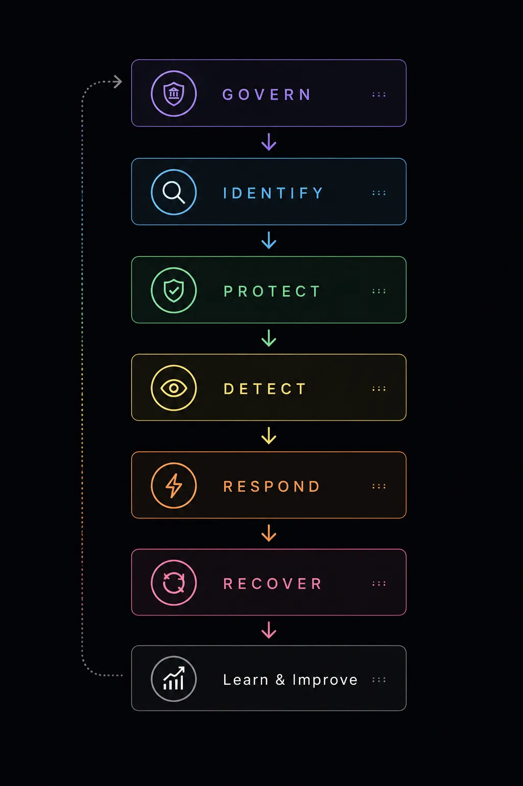
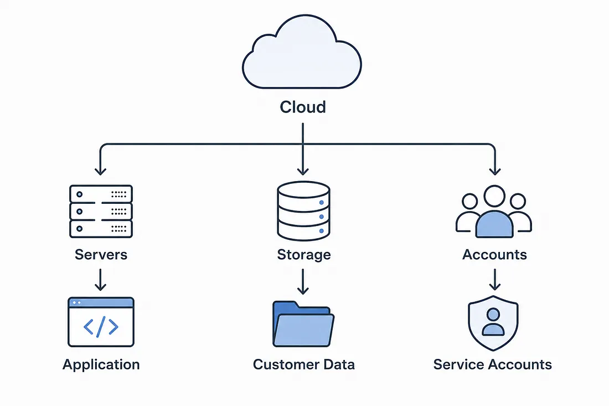
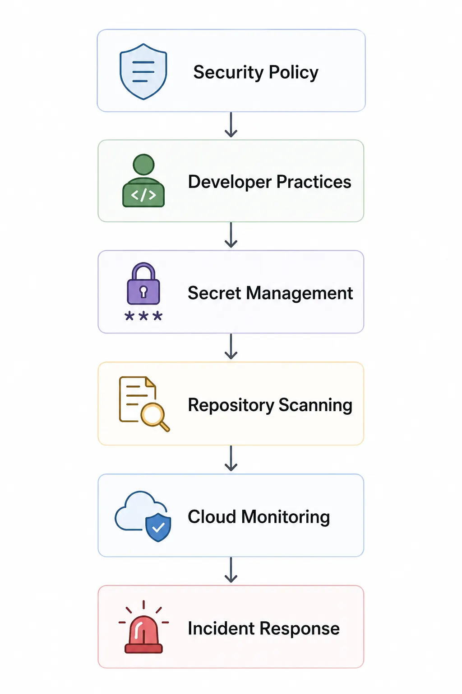
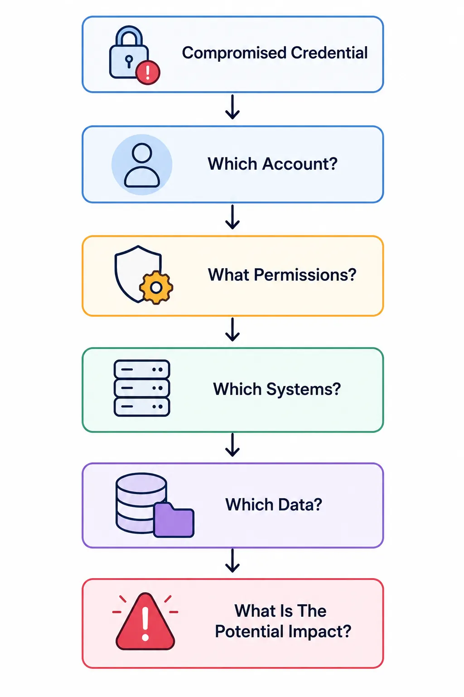
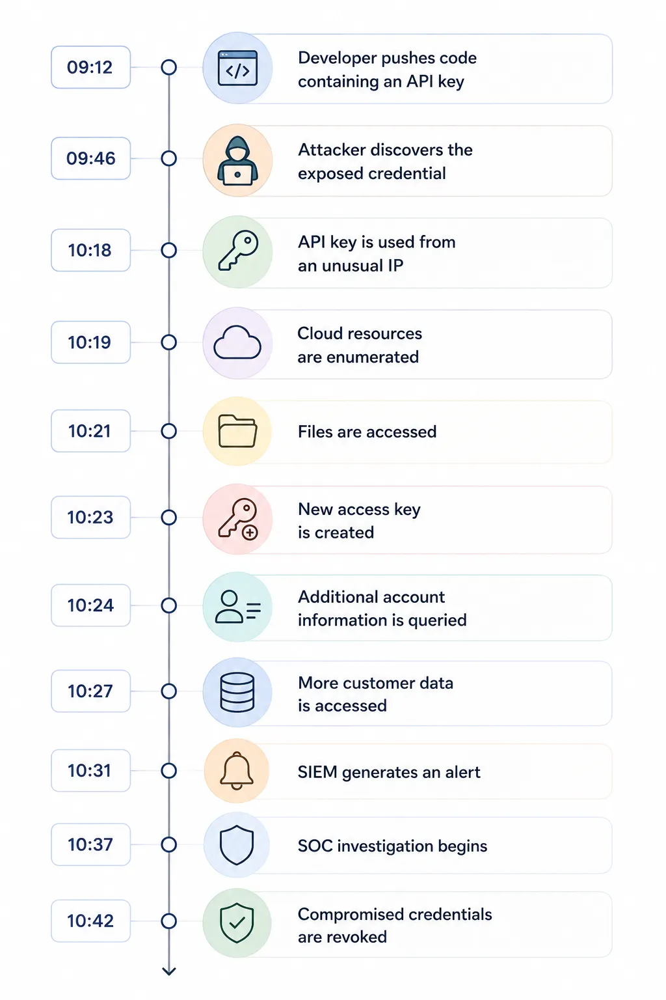
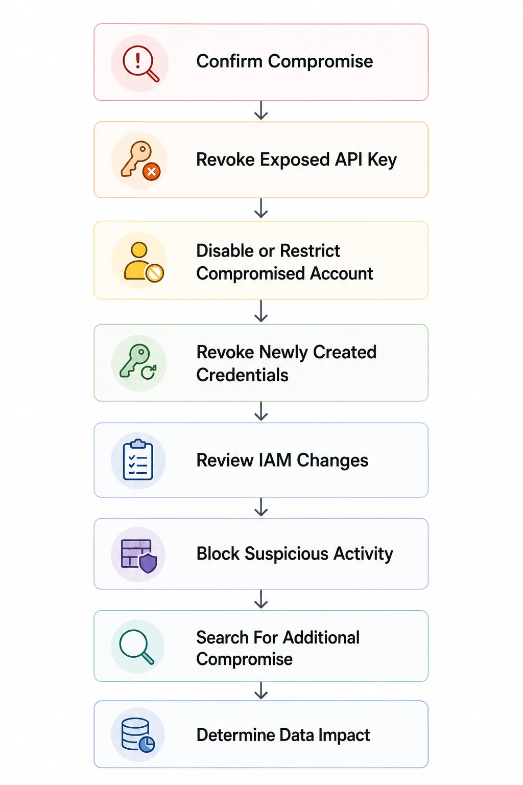
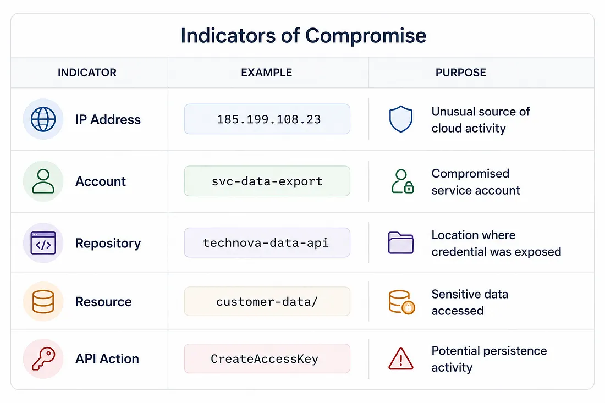
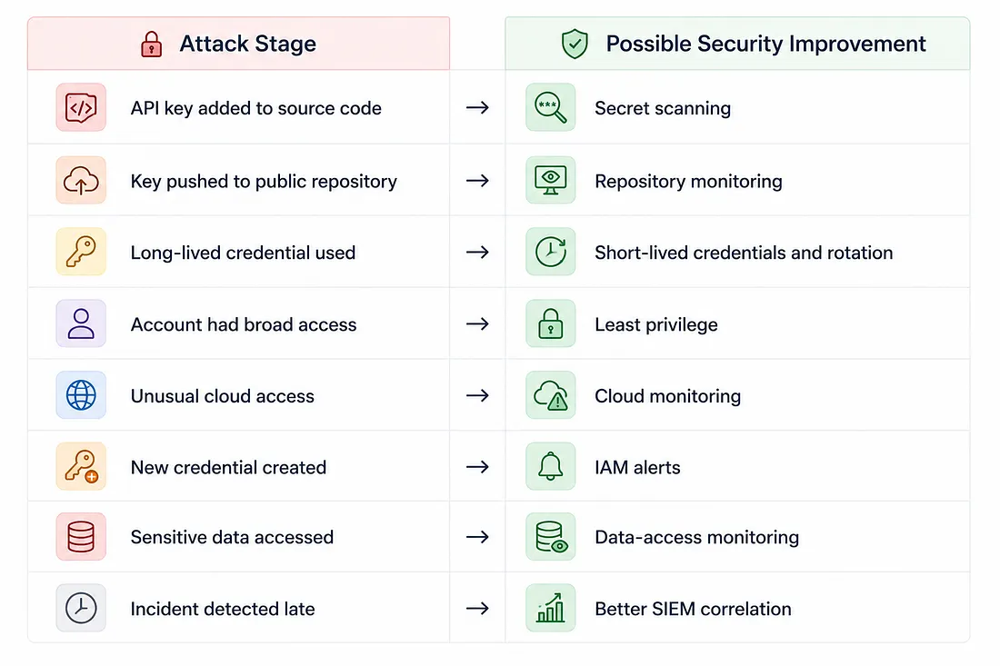
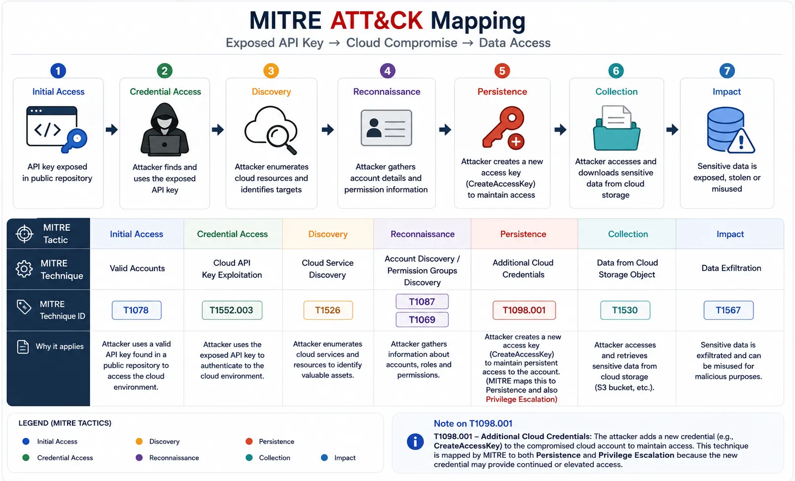

# One Exposed API Key, One Cloud Breach: A SOC Investigation Using NIST CSF 2.0

## How a small credential mistake turned into a cloud security incident, and what a SOC analyst can learn from it

## Introduction

When I first started learning about cybersecurity, I thought most attacks began with something complicated: a vulnerability, malware, a malicious attachment, or an exploit.

But while learning more about security operations, I started noticing something important.

Attackers do not always need a sophisticated vulnerability.

Sometimes, they just need something that has already been exposed.

In this scenario, a developer accidentally publishes a cloud API key to a public code repository. An attacker discovers the key, uses it to access the company’s cloud environment, looks around, accesses sensitive data, and creates another credential to maintain access.

In this article, I will walk through the incident from the perspective of a SOC analyst and use NIST CSF 2.0 to understand the different stages of the attack and response.

---

## First, What Exactly Is NIST CSF 2.0?

Before investigating the attack, I wanted to understand what the NIST Cybersecurity Framework actually means.

NIST stands for the **National Institute of Standards and Technology**.

The NIST Cybersecurity Framework is a framework that helps organizations understand, manage, communicate, and reduce cybersecurity risk.

CSF 2.0 was released in February 2024 and expanded the framework to include six functions:



The six functions are:

1. **Govern**
2. **Identify**
3. **Protect**
4. **Detect**
5. **Respond**
6. **Recover**

---

## The Incident: How Did It Start?

TechNova (fictional company) develops a web application and uses cloud services to store application files, logs, and customer information.

> A cloud environment is basically a collection of computing, storage, networking, and identity services that an organization uses through a cloud provider.

For example, a company might have:

- Servers running applications
- Storage containing files
- Databases containing information
- User accounts
- Service accounts used by applications
- Credentials that allow those accounts to access resources

Our environment looks like this:



One of those service accounts is used by an internal application to access cloud storage.

Let’s call it:

> **svc-data-export**

The application needs a credential to authenticate to the cloud. The developer creates an API key for this purpose. And this is where the problem begins.

---

## The Developer Makes a Small Mistake

The developer stores the API key inside the application code.

Something similar to this:

```text
API_KEY = "H5sHxxxxxxxxxxxxxxxx"
```

The developer then pushes the code to a public repository. The repository is visible to anyone on the internet. The API key is now exposed.

At this point, the attacker has not necessarily compromised the company yet. They have simply found a credential. But that credential may be enough.

---

# 1. GOVERN — Why Was This Possible?

Govern is about establishing and monitoring the organization’s cybersecurity strategy, expectations, responsibilities, and policies. NIST added Govern as a new function in CSF 2.0 to make the role of cybersecurity governance more visible.

So instead of asking only:

> **“Who leaked the API key?”**

We should ask:

> **“Why was a production credential allowed to reach a public repository?”**

A mature organization should have rules around things such as:

- How developers handle secrets
- How cloud credentials are created
- Who is responsible for cloud security
- How credentials are rotated
- How public repositories are monitored
- What happens when a credential is exposed

The organization should also have technical controls supporting those policies.

For example:



---

# 2. IDENTIFY — What Could Be Affected?

This is where the organization tries to understand what it has and what risks are associated with those assets.

For our incident, we need to understand what the exposed API key can actually access.

Suppose the key belongs to:

> **svc-data-export**

And this service account can access **public-assets, application-logs, and customer-data**

Now the incident becomes much more serious. If the key only accessed test files, the impact might be small. But if it can access customer information, the risk is much higher. This is why asset and access visibility is important.

The SOC analyst needs to know not only **which credential was compromised** but also **what that credential could access**.

---

# 3. PROTECT — What Should Have Stopped the Attack?

This is where organizations put safeguards in place to reduce cybersecurity risk.

For our scenario, several controls could have helped.

### Secret Management

Instead of storing the API key directly in the source code, the application could retrieve it from a secure secret-management system.

### Least Privilege

The service account should have only the permissions it actually needs.

If an application only needs access to one storage location, it should not automatically have access to everything.

### Credential Rotation

Credentials should not remain valid forever. Regular rotation reduces the amount of time an exposed credential can be useful.

### Repository Scanning

Security tools can scan repositories for credentials and alert developers when a secret is detected.

### Cloud Logging

Cloud activity should be logged so that suspicious use of credentials can be investigated.

But in our scenario, the API key still reached the public repository.

---

# 4. DETECT — The First Sign of the Attack

The attacker discovers the API key and tries to use it.

The first suspicious cloud event appears in the logs.

For example:

```text
Time:       10:18:42
Account:    svc-data-export
Source IP:  185.199.108.23
Action:     ListBuckets
Result:     SUCCESS
```

At first, this may not look like a serious attack.

**ListBuckets** simply means the account is asking the cloud environment what storage resources are available.

But the source is unusual. The service account normally operates from TechNova’s application servers.

Why is it suddenly being used from a new external IP address?

That is the question a SOC analyst should ask.

We then look at what happened next.

```text
10:18:42  ListBuckets
10:19:05  ListBucketContents
10:21:12  GetObject
10:23:45  CreateAccessKey
10:24:02  ListUsers
10:27:19  GetObject
```

Now the activity starts to tell a story.

The attacker appears to be:

1. Discovering available resources
2. Looking inside storage
3. Accessing files
4. Creating another credential
5. Looking for additional accounts

This is why looking at a single alert is often not enough. A **SOC analyst** needs to connect related events.



In this case, the SOC detection might be based on a combination of:

- Unusual source IP
- Unusual location
- Unusual service-account activity
- Unexpected API calls
- New credential creation
- Access to sensitive storage

The individual events may not always be malicious by themselves.

The **combination** is what makes them suspicious.

---

# 5. Investigating the Incident

Now that the alert has been generated, the SOC analyst needs to determine whether this is actually malicious.

### Where Did the Activity Come From?

The account was used from:

> **185.199.108.23**

This is not a normal source for the service account.

That gives us our first useful indicator.

### What Account Was Used?

The activity came from:

> **svc-data-export**

This tells us which credential and identity need to be investigated.

### What Did the Attacker Do?

The logs show resource discovery and file access.

That means the attacker was not simply testing the credential.

They were actively interacting with the environment.

### Did They Try to Maintain Access?

One event is especially interesting:

> **CreateAccessKey**

The attacker appears to have created another credential.

This is important because simply disabling the original API key may not be enough anymore.

We need to investigate the newly created credential as well.

### What Data Was Accessed?

The logs show requests against:

> **customer-data/**

Now we have to determine whether sensitive information was actually downloaded.

This is where the investigation becomes more than just “a credential was exposed.”

We are trying to answer:

> **What did the attacker actually do after gaining access?**

---

# 6. Building the Timeline

It helps turn many individual logs into one understandable sequence.



---

# 7. RESPOND — What Should We Do Now?

Once the SOC has enough evidence to confirm that the activity is malicious, the next step is response.

The first priority is **containment**.



The SOC and incident-response team need to preserve the evidence required to understand what happened.

That could include:

- Cloud audit logs
- Authentication records
- API activity
- Source IP addresses
- IAM changes
- Accessed resources
- Timestamps
- Affected accounts

---

# 8. RECOVER — Getting Back to Normal

After containment, the organization needs to recover.

We still need to understand the damage and make sure the same problem does not happen again.

For TechNova, recovery could include:

### Rotate Related Credentials

Any credentials that may have been exposed should be reviewed and rotated.

### Review Permissions

The compromised account’s permissions should be checked. If it had access to more resources than necessary, those permissions should be reduced.

### Review the Accessed Data

The security team should determine exactly which data was accessed and whether it was downloaded.

### Search for Persistence

The team should look for anything the attacker may have created to regain access later.

For example:

- New users
- New API keys
- New roles
- Modified permissions
- Unexpected configuration changes

### Improve Secret Management

The exposed credential should be removed from source code and replaced with a safer method of handling secrets.

### Improve Detection

The SOC should consider whether a detection rule should be created or improved for similar activity in the future.

This is where recovery connects back to improvement.

The goal is not just to return the environment to normal.

The goal is to return it **stronger than before the incident**.

---

# 9. Indicators of Compromise



---

# 10. What Could Have Prevented the Incident?

Where could TechNova have broken the attack chain?



This approach shows that cybersecurity is rarely about one perfect security control. Instead, we want multiple layers. If one control fails, another control should ideally reduce the impact or detect the attack.

---

# MITRE ATT&CK Mapping



---

# Key Takeaways

- An exposed credential can become a serious security incident even without exploiting a software vulnerability.
- Cloud security depends heavily on proper identity and access management.
- Least privilege can reduce the impact of a compromised account.
- Logs become much more useful when multiple events are correlated into a timeline.
- Detection is only one part of incident response; containment, investigation, recovery, and improvement are equally important.
- NIST CSF 2.0 provides a useful way to look at cybersecurity risk from a broader organizational perspective.
- MITRE ATT&CK can complement NIST by helping analysts describe attacker behavior and techniques.

---

# Conclusion

This scenario demonstrates how a seemingly small developer mistake can develop into a broader cloud security incident.

The attack did not begin with a sophisticated exploit.

It began with an exposed credential.

Once that credential was discovered, the attacker was able to use legitimate cloud functionality to discover resources, access data, and create another credential.

From a SOC perspective, the most important lesson is that **individual cloud events need context**.

A single `ListBuckets` event may not be enough to declare an incident.

But when it is followed by storage enumeration, data access, account discovery, and `CreateAccessKey` from an unusual source, the sequence becomes much more suspicious.

NIST CSF 2.0 provides a useful framework for looking at the incident across governance, identification, protection, detection, response, and recovery, while MITRE ATT&CK helps describe the adversary behaviors observed during the attack.

Ultimately, the goal is not simply to detect the attacker.

It is to understand **why the attack was possible, what the attacker could access, how quickly the organization can contain it, and how to make the environment stronger afterward**.

---

## Disclaimer

**TechNova is a fictional company used for educational purposes.**

The cloud events, account names, IP address, and investigation scenario presented in this article are part of the educational scenario described above and should not be interpreted as evidence of a real-world breach.

The techniques and security controls discussed are intended for authorized defensive security, SOC analysis, and cybersecurity education.
