# Hunting Suspicious Process Creation with Sysmon

## Episode 01: Hunting Process Creation & PowerShell

In this first episode of my Endpoint Threat Hunting series, I use Sysmon Event ID 1 on a Windows 10 endpoint to investigate process execution, parent-child relationships, PowerShell activity, encoded commands, and suspicious LOLBin execution.

The goal isn’t to label every unusual process as malicious. It’s to investigate the context, validate the evidence, and determine whether an activity is benign, suspicious, or worth escalating.

**Environment:** Windows 10 + Sysmon  
**Focus:** Sysmon Event ID 1 — Process Creation

---

## Scenario: Suspicious PowerShell Activity

A SOC analyst receives an alert indicating unusual PowerShell activity on a Windows endpoint.

Instead of immediately classifying the activity as malicious, the analyst begins with Sysmon **Event ID 1 — Process Creation** and investigates:

- Which process was created?
- What process launched it?
- What command was executed?
- Which user initiated it?
- Was the execution context expected?
- Does the process chain provide additional reasons for investigation?

---

## Hunt 1 — Establishing a Baseline

> **Observed:** `explorer.exe → eventvwr.exe`

The executable, command line, user, parent process, integrity level, and timestamp were examined.

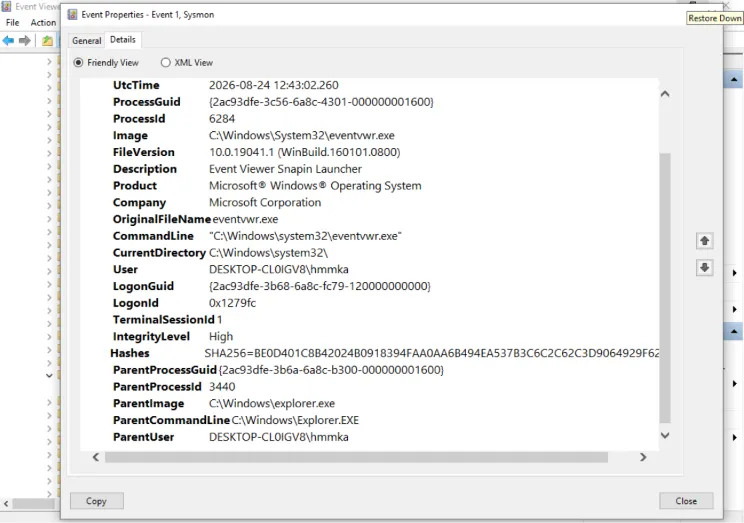

**Assessment:** **Benign**

**eventvwr.exe** was launched from the expected **explorer.exe** parent process, with a normal command line and user context. No unusual execution arguments were observed.

---

## Hunt 2 — PowerShell → Notepad

We then deliberately launched:

```text
notepad.exe
```

from PowerShell. The resulting process tree was:

> **powershell.exe → notepad.exe**

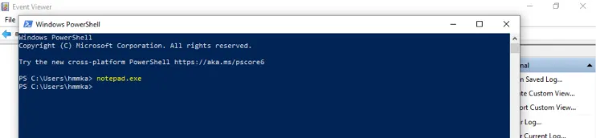

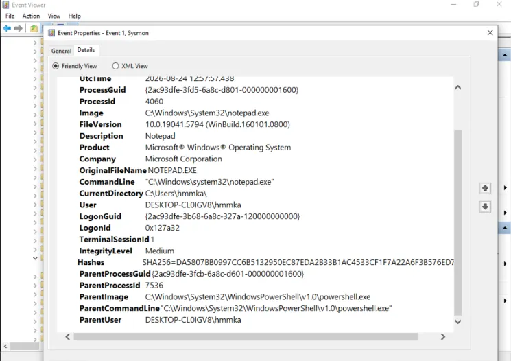

**Assessment:** **Benign**

**notepad.exe** was directly launched from PowerShell by the same user, matching the command we intentionally executed. The process path and execution context were consistent with normal Windows activity.

This introduced **parent-child process analysis**.

---

## Hunt 3 — PowerShell → PowerShell → Get-Process

We then generated:

```powershell
powershell.exe -NoProfile -Command "Get-Process"
```

The process chain became:

> **powershell.exe → powershell.exe → Get-Process**

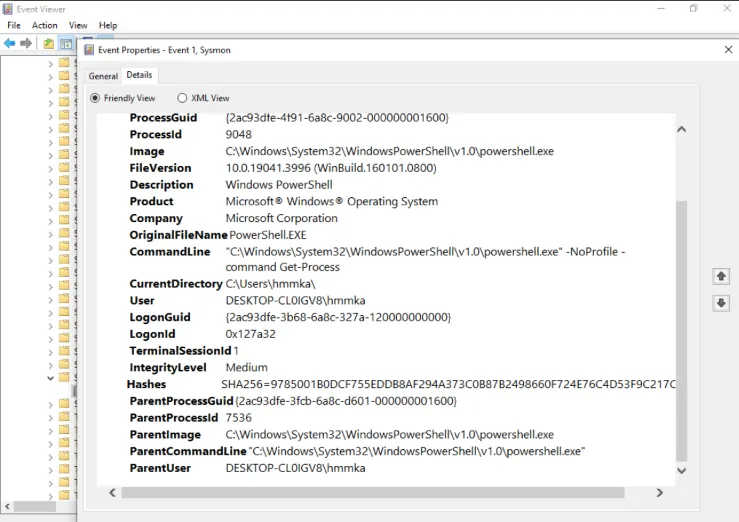

**Assessment:** **Benign**

The child PowerShell process executed the standard **Get-Process** cmdlet, with no suspicious arguments or unexpected parent process. The activity matched our controlled test.

---

## Hunt 4 — Encoded PowerShell

Next, we generated a PowerShell execution using:

```powershell
powershell.exe -NoProfile -EncodedCommand VwByAGkAdABlAC0ATwB1AHQAcAB1AHQAIAAiAFMATwBDACAATABhAGIAIABUAGUAcwB0ACIA
```

Initially, the event was classified as:

> **Suspicious — requires investigation**

The use of **-EncodedCommand** obscured the actual PowerShell command, making the event worth investigating.

The command wasn’t visible in plaintext, so we extracted the encoded value and decoded it.

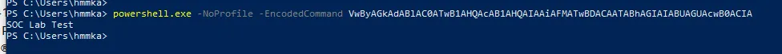


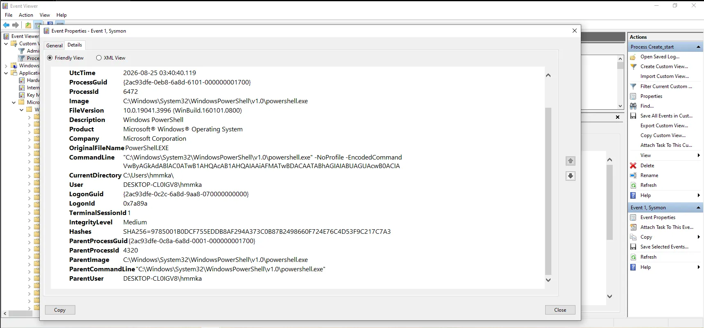

**Assessment:** **Benign**

After decoding the Base64 payload, it contained only **Write-Output "SOC Lab Test."** No malicious execution or system modification was observed.

---

## Hunt 5 — PowerShell Execution Context

We investigated:

```powershell
powershell.exe -NoProfile -NonInteractive -Command "Get-Date"
```

The parameters initially looked interesting, but examining the complete command showed that it only executed:

> **Get-Date**

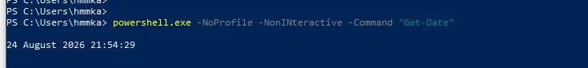

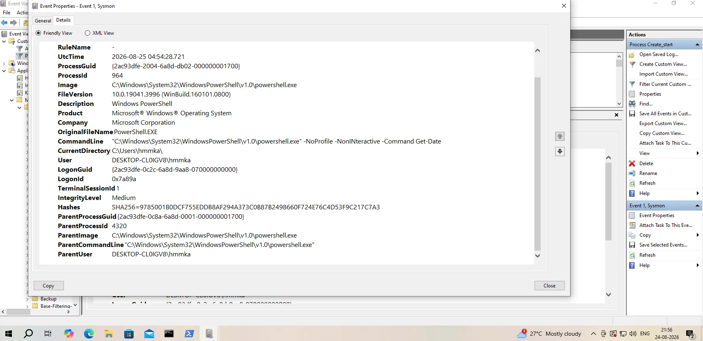

**Assessment:** **Benign**

Although **-NoProfile** and **-NonInteractive** can be useful hunting indicators, the command ultimately executed only **Get-Date**. The user, parent process, and medium integrity level were consistent with our controlled activity.

---

## Hunt 6 — PowerShell → cmd.exe

We then investigated:

> **PowerShell → cmd.exe → whoami**

```cmd
cmd.exe /c whoami
```

was executed under the same user and medium integrity level.


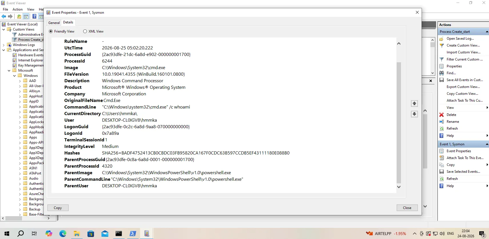

**Assessment:** **Benign controlled activity**

**cmd.exe** was spawned by PowerShell to execute the harmless **whoami** command. Both processes ran under the same user and medium integrity level, with no additional suspicious arguments.

But in a real investigation, this relationship would still be worth examining depending on the command and surrounding activity.

---

## Hunt 7 — PowerShell → mshta.exe

Now we moved into a more security-relevant process relationship:

> **PowerShell → mshta.exe**

**mshta.exe** is a legitimate Windows component, but its execution can be abused by attackers.

```powershell
powershell.exe -NoProfile -Command "Start-Process mshta.exe"
```

Therefore:

> **PowerShell spawning mshta.exe becomes a higher-priority hunting lead, not an automatic malicious verdict.**

**Assessment:** **Suspicious — requires investigation**


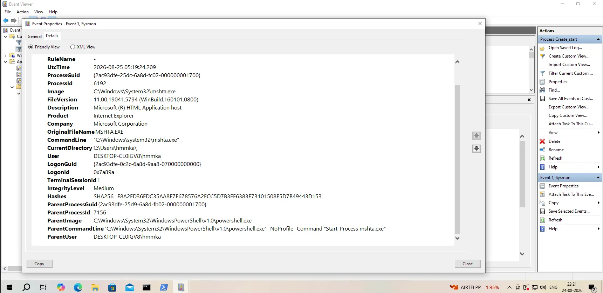

---

## Hunt 8 — mshta.exe with an Argument

We then compared it with:

> **PowerShell → mshta.exe → about:blank**

The additional argument gave us more context, but the event remained benign because **about:blank** contained no malicious resource.

```powershell
powershell.exe -NoProfile -Command "Start-Process mshta.exe -ArgumentList 'about:blank'"
```

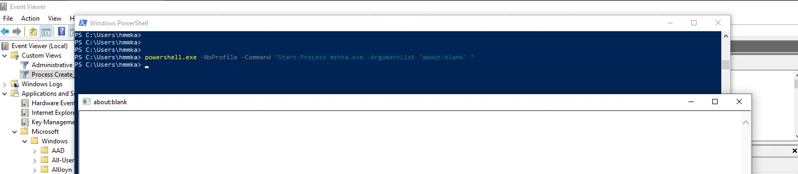

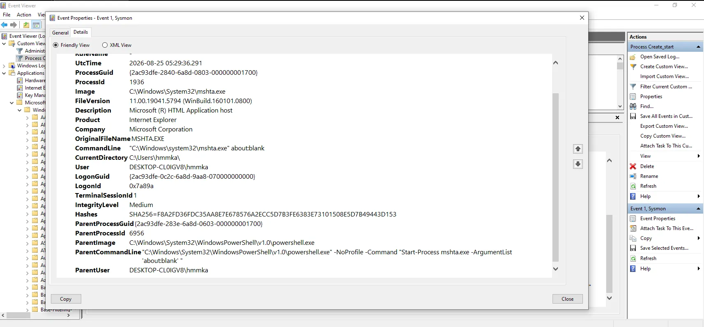

**Assessment:** **Benign**

Although **mshta.exe** was launched by PowerShell with an argument, the argument was only **about:blank**. No external resource or suspicious payload was involved.

---

## Hunt 9 — mshta.exe Executing an HTA File

Finally, we created a controlled local HTA.

Open **PowerShell** and run:

```powershell
New-Item -ItemType Directory -Path C:\SOC-Lab -Force
```

Then:

```powershell
@'
<html>
<head>
<HTA:APPLICATION APPLICATIONNAME="SOC Lab Test">
<title>SOC Lab Test</title>
</head>
<body>
<h2>SOC Lab - Controlled Test</h2>
</body>
</html>
'@ | Set-Content C:\SOC-Lab\test.hta
```

This creates:

> **C:\SOC-Lab\test.hta**

It’s just a local test page.

### Execute it through PowerShell

```powershell
powershell.exe -NoProfile -Command "Start-Process mshta.exe -ArgumentList 'C:\SOC-Lab\test.hta'"
```

and observed:

> **PowerShell → mshta.exe → C:\SOC-Lab\test.hta**

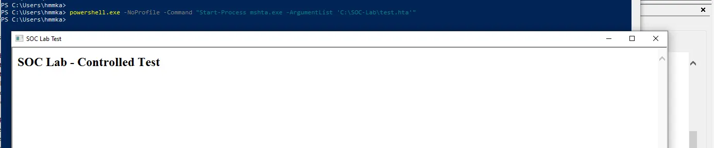

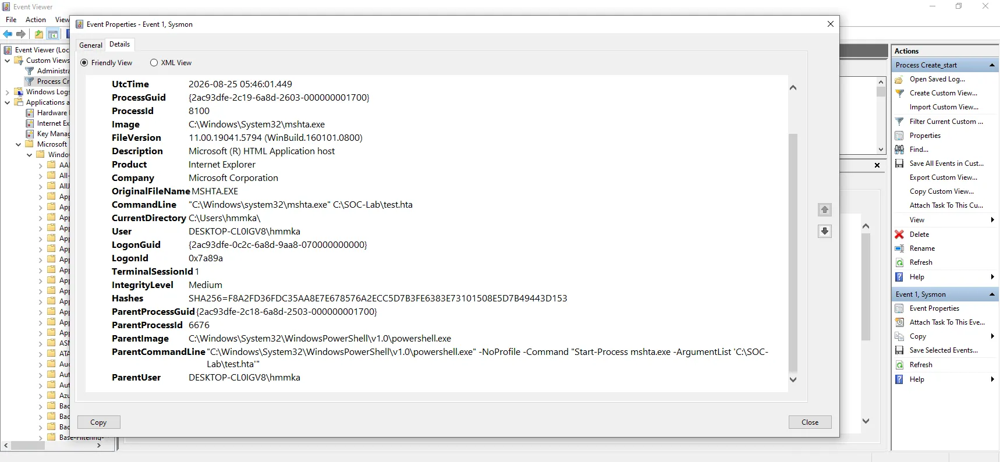

**Assessment:** **Benign controlled activity**

The **.hta** file was created locally as part of the lab and contained only harmless test content. We therefore had known provenance and expected behavior, although the process chain would warrant investigation in an unknown environment.

---

## Key Findings and Observations

This episode focused on one telemetry source: **Sysmon Event ID 1**.

Starting from normal Windows activity, we progressed into:

- Normal Windows process creation
- PowerShell process execution
- Parent-child process analysis
- Nested PowerShell execution
- Encoded PowerShell commands
- PowerShell execution-context analysis
- PowerShell spawning `cmd.exe`
- Security-relevant `mshta.exe` execution
- `mshta.exe` arguments
- Local HTA execution

The important lesson is that **process names alone are not enough to determine whether activity is malicious**.

A legitimate executable can become a useful hunting lead when its parent process, command line, arguments, user context, integrity level, or surrounding activity are unusual.

Likewise, a suspicious-looking command can be benign when the analyst can establish clear provenance and expected behavior.

---

## Investigation Approach

The investigation repeatedly followed the same SOC-style reasoning:

1. Identify the created process.
2. Examine the parent-child relationship.
3. Review the command line and arguments.
4. Validate the user and execution context.
5. Determine whether the activity was expected.
6. Investigate suspicious characteristics rather than immediately declaring the event malicious.
7. Establish the final assessment using the available evidence.

This approach helps reduce false positives while still identifying process relationships that deserve deeper investigation.

---

## Conclusion

Sysmon Event ID 1 provides valuable visibility into process creation and the relationships between processes.

In this controlled Windows 10 lab, activities that initially looked suspicious—including encoded PowerShell and PowerShell spawning `mshta.exe`—could be classified correctly only after examining the full execution context.

The next episode will move beyond process creation and investigate **DNS activity**, allowing us to connect endpoint processes with the domains they query.

---

## Attribution / Lab Context

This article documents a controlled endpoint threat-hunting exercise performed in a Windows 10 + Sysmon environment.

The demonstrations were intentionally generated for investigation and learning. The technical activity, observations, screenshots, and conclusions should be interpreted within that controlled lab context.

## Disclaimer

This material is provided for cybersecurity education and authorized defensive security testing. Do not reproduce these techniques against systems or environments without appropriate authorization.
