# Hunting DNS Activity with Sysmon

## Episode 02 — A DNS Query Requires Context

In Episode 02 of my Endpoint Threat Hunting series, I moved from **Sysmon Event ID 1 — Process Creation** to **Event ID 22 — DNS Query**.

The objective was not simply to find unusual domains but to understand **which process generated the query, which user was involved, when it happened, whether the query succeeded, and whether the activity was actually suspicious**.

**Environment:** Windows 10 + Sysmon  
**Focus:** Sysmon Event ID 22 — DNS Query

---

## Scenario

A SOC analyst receives an alert involving DNS activity from a Windows endpoint.

At first glance, the analyst might ask:

- What domain was queried?
- Which process generated the query?
- Which user generated it?
- Did the query succeed?
- When did it happen?
- Can it be correlated with process-creation activity?

A DNS query by itself doesn’t tell us whether a system is compromised.

---

## Hunt 1 — Establishing a DNS Baseline

The first Event ID 22 we examined was generated by Sysmon itself.

```text
QueryName:    1.37.209.20.in-addr.arpa
QueryStatus:  9003
Image:        C:\Windows\Sysmon64.exe
User:         NT AUTHORITY\SYSTEM
```

The query uses the `.in-addr.arpa` namespace, which is associated with **reverse DNS lookups**.

The process context was:

> **Sysmon64.exe → DNS Query → Reverse DNS name**

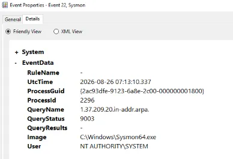

**Assessment: Benign / telemetry-related**

The query was associated with the Sysmon process running under the SYSTEM account, and the reverse DNS lookup returned status **9003**, meaning the queried DNS name did not exist.

---

## Hunt 2 — PowerShell → `example.com`

Next, I deliberately generated a DNS query from PowerShell:

```powershell
Resolve-DnsName example.com
```

The resulting Sysmon event showed:

```text
QueryName:    example.com
QueryStatus:  0
Image:        powershell.exe
User:         DESKTOP-CL0IGV8\hmmka
```

The activity can be represented as:

> **PowerShell → DNS Query → example.com**

QueryStatus = `0` indicated that the DNS query completed successfully, with DNS records returned.

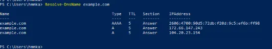

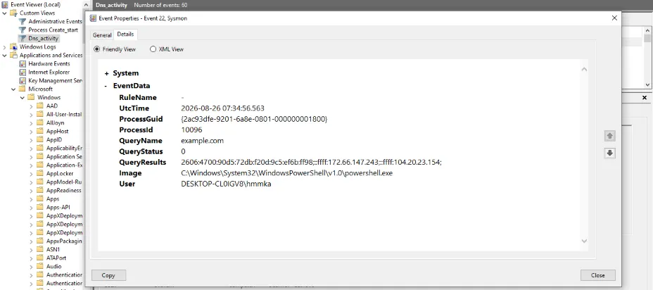

**Assessment: Benign controlled activity**

The query was intentionally generated using **Resolve-DnsName**, the process was legitimate PowerShell running under the expected user, and the requested domain was a normal test domain.

---

## Hunt 3 — PowerShell → Non-Resolvable Domain

The next test was designed to understand how a failed DNS lookup appears in Sysmon.

I ran:

```powershell
Resolve-DnsName soc-lab-test.invalid
```

The Event ID 22 showed:

```text
QueryName:    soc-lab-test.invalid
QueryStatus:  9003
Image:        powershell.exe
User:         DESKTOP-CL0IGV8\hmmka
```

The activity looked like this:

> **PowerShell → DNS Query → Non-existent domain**

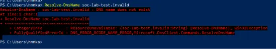

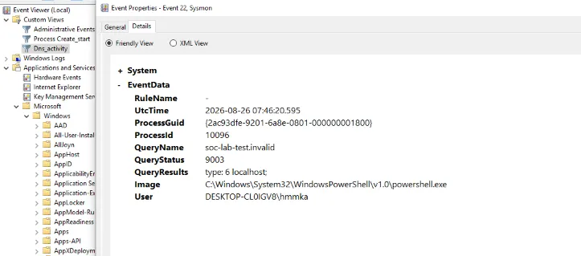

**Assessment: Benign controlled activity**

The **.invalid** namespace is reserved for names that should not resolve, and the query was intentionally generated as part of the lab.

---

## Hunt 4 — Random-Looking DNS Query

Does a random-looking domain automatically mean malicious activity?

I generated:

```powershell
Resolve-DnsName x7k3m9q2.soc-lab.invalid
```

The resulting Event ID 22 contained:

```text
QueryName:    x7k3m9q2.soc-lab.invalid
QueryStatus:  9003
Image:        powershell.exe
User:         DESKTOP-CL0IGV8\hmmka
```

The process flow was:

> **PowerShell → DNS Query → Random-looking domain → NXDOMAIN**

At first glance, the random-looking subdomain could attract attention.

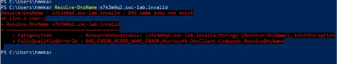

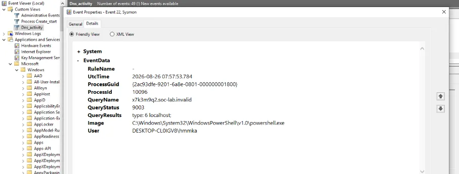

**Assessment: Benign controlled activity**

The domain was intentionally generated for the lab and belonged to the reserved **.invalid** namespace. The query was generated by legitimate PowerShell, and the failed resolution was expected.

---

## Hunt 5 — Correlating Process Creation with DNS Activity

This was the most important hunt in the episode.

The objective was to answer:

> **Can we prove which PowerShell process generated a DNS query?**

Instead of relying only on timestamps, I used **ProcessGuid** as the correlation key.

### Attempt 1 — Unsuccessful Correlation

I first generated:

```powershell
powershell.exe -NoProfile -Command "Resolve-DnsName example.com"
```

The DNS event showed:

```text
ProcessId:   7872
ProcessGuid: {00000000-0000-0000-0000-000000000000}
Image:       <unknown process>
QueryName:   example.com
```

The process tree could not be reliably established:

> **Unknown Process → DNS Query → example.com**

The zeroed **ProcessGuid** and **<unknown process>** meant that there wasn't enough process identity information to confidently correlate this Event ID 22 with an Event ID 1.

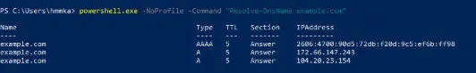

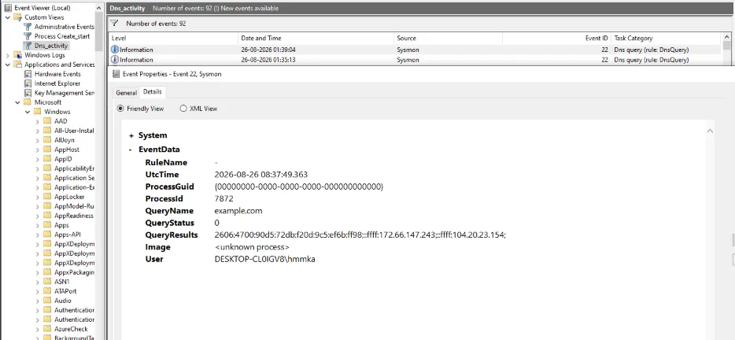

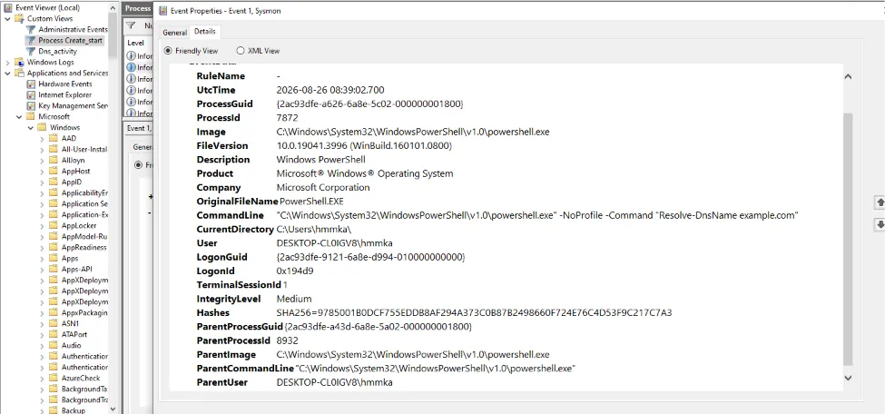

**Assessment: Correlation unsuccessful**

This wasn’t treated as malicious. Instead, it demonstrated an important telemetry limitation:

> **Before correlating events, validate that the telemetry contains reliable process identity information.**

---

### Attempt 2 — Successful Correlation

To keep the PowerShell process alive while generating DNS activity, I used:

```powershell
while ($true) {
    Resolve-DnsName example.com
    Start-Sleep 5
}
```

This time, I obtained a valid **Event ID 1 — Process Creation**:

```text
ProcessGuid:
{2ac93dfe-a824-6a8e-7002-000000001800}

ProcessId:
3552

Image:
C:\Windows\System32\WindowsPowerShell\v1.0\powershell.exe

User:
DESKTOP-CL0IGV8\hmmka
```

The corresponding Event ID 22 contained the **same**:

```text
ProcessGuid:
{2ac93dfe-a824-6a8e-7002-000000001800}

ProcessId:
3552

Image:
C:\Windows\System32\WindowsPowerShell\v1.0\powershell.exe

QueryName:
example.com
```

The important point is that the **ProcessGuid and ProcessId matched**, allowing us to confidently associate the DNS activity with the PowerShell process.

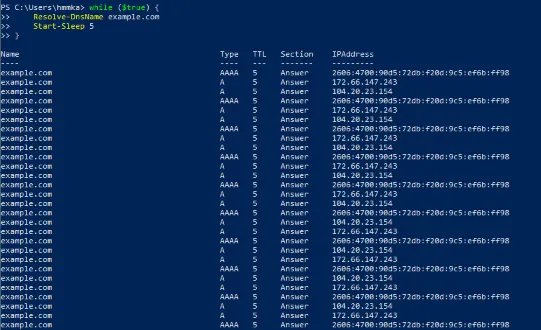

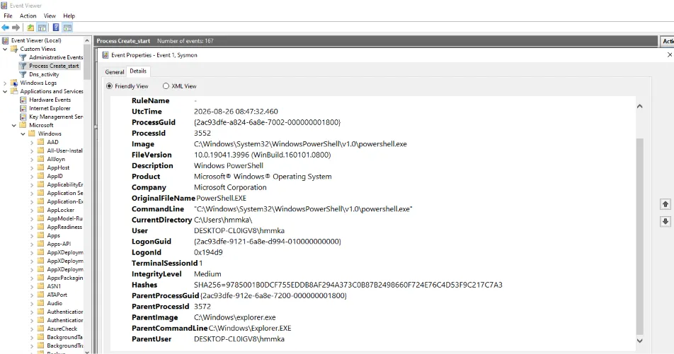

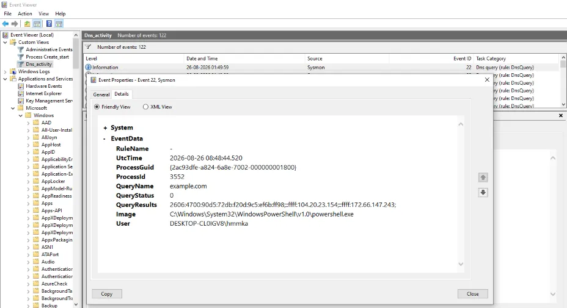

**Assessment: Benign controlled activity**

The PowerShell process was intentionally created for the lab and queried **example.com**. The matching ProcessGuid and ProcessId confirmed the relationship between the process and DNS event.

---

## Important DNS Investigation Fields

Across these hunts, the important DNS investigation fields were:

```text
QueryName
Image
User
UtcTime
QueryStatus
QueryResults
ProcessId
ProcessGuid
```

These fields help move an investigation beyond simply asking whether a domain looks suspicious.

The analyst can instead establish:

- What was queried?
- Which process made the query?
- Which user was involved?
- When did it occur?
- Did the query succeed?
- What results were returned?
- Can the DNS event be correlated to process-creation telemetry?

---

## Key Investigation Lessons

### 1. A DNS query alone is not enough

A domain name should be investigated in context. A failed lookup, a reverse DNS request, or a random-looking domain can all be benign depending on the surrounding evidence.

### 2. Query status matters

A successful DNS query and a failed DNS query provide different investigative context.

In these controlled tests:

- `QueryStatus = 0` represented a successful lookup.
- `QueryStatus = 9003` represented a non-existent DNS name.

### 3. Process context matters

Knowing that PowerShell generated a DNS request gives the analyst an important additional investigation point.

The process image and user context help determine whether the activity was expected.

### 4. Correlation requires reliable telemetry

The unsuccessful correlation demonstrated that an Event ID 22 with a zeroed **ProcessGuid** and `<unknown process>` cannot safely establish a process relationship.

The successful correlation demonstrated the value of matching **ProcessGuid** and **ProcessId** between Event ID 1 and Event ID 22.

---

## Conclusion

This episode moved from simple DNS-event observation to contextual investigation and process correlation.

The main lesson is:

> **A DNS query requires context.**

The domain alone is not enough. A SOC analyst should investigate the query alongside the process, user, timestamp, query status, results, and available process identity information.

The next episode will take this one step further by investigating **Network Activity** — connecting a process to actual network connections, destination IPs, ports, and connection context.

> **A DNS query tells us where a process tried to resolve. Network telemetry can tell us where it actually connected.**

---

## Attribution / Lab Context

This article documents a controlled endpoint threat-hunting exercise performed in a Windows 10 + Sysmon environment.

The demonstrations were intentionally generated for investigation and learning. The technical activity, observations, screenshots, and conclusions should be interpreted within that controlled lab context.

## Disclaimer

This material is provided for cybersecurity education and authorized defensive security testing. Do not reproduce these techniques against systems or environments without appropriate authorization.
